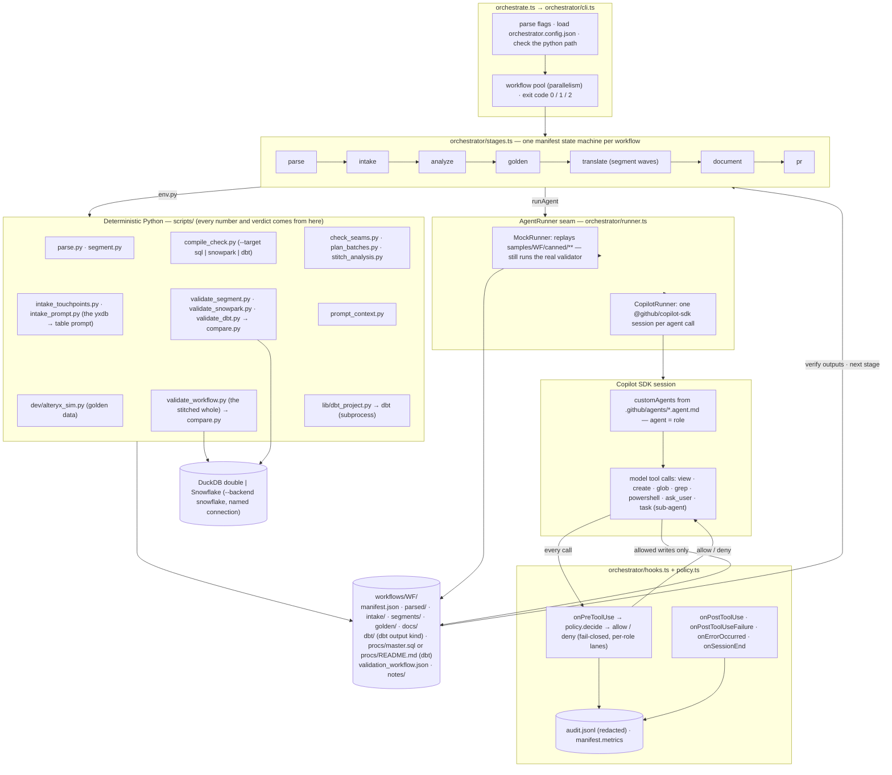
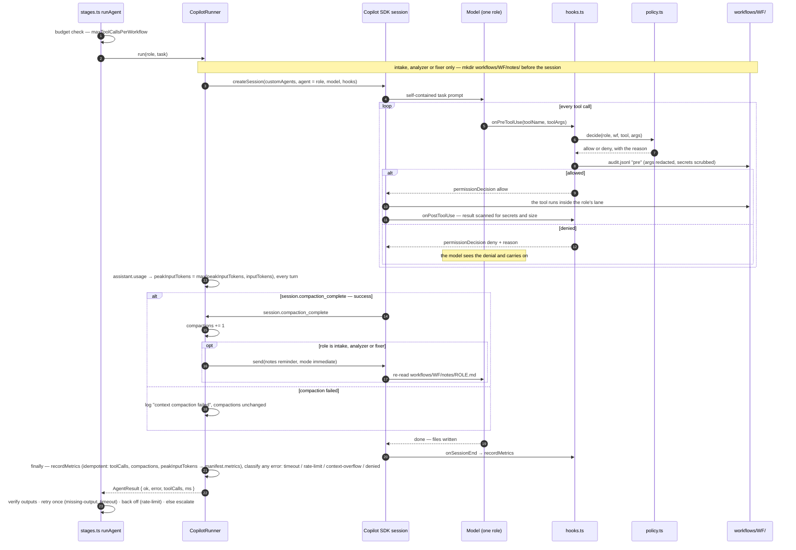
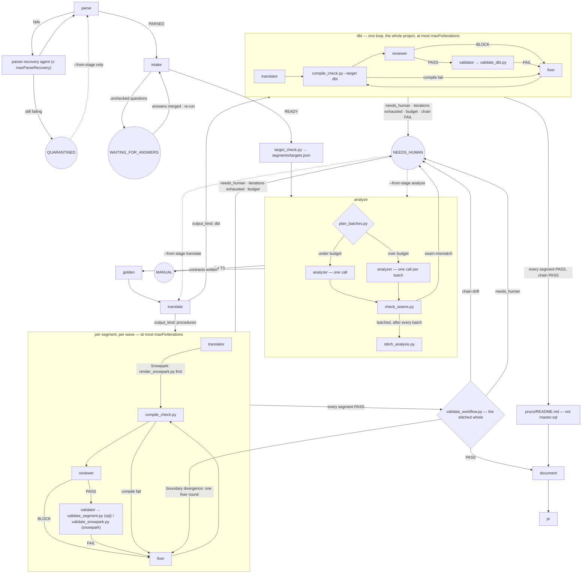

# Alteryx → Snowflake migration pipeline

## 1. What this is

An offline-first pipeline that turns an Alteryx workflow (`.yxmd`) into a Snowflake stored
procedure, proves it against golden data, and hands it over with documentation. Deterministic
Python scripts under `scripts/` do the parsing, segmentation, SQL translation-checking and
validation; a TypeScript orchestrator (`orchestrate.ts` / `orchestrator/*.ts`) drives a state
machine over those scripts and **eight** GitHub Copilot custom agents (`.github/agents/*.agent.md`,
`orchestrator/types.ts`'s `Role`/`ROLES`: intake, analyzer, translator, reviewer, validator, fixer,
parser-recovery, documenter). There are **nine** `.agent.md` files in total: the ninth,
`cookbook-curator`, is CLI-only — a human runs it directly through the Copilot CLI to propose
`cookbook/*.md` updates (never edited directly) — and is not wired into the orchestrator's state
machine at all. The scripts and the agents never call each other directly — the only interface
between every piece is files under `workflows/<wf_id>/`, so any stage can be re-run, inspected or
replaced without touching the others. The user's one explicit requirement beyond the written
program spec is built in: **the pipeline asks a human to name the Snowflake table for every
`.yxdb` file (and every other input and output)**, and it never invents one
(`scripts/intake_prompt.py`, §5 below).

### Architecture at a glance

Three diagrams, all drawn from the code as it stands (`orchestrator/*.ts`, `scripts/*.py`) — the
three output targets, the batched analyzer with its seam check, and the chain-checked translate
stage are all in them now; the file names are real. GitHub renders them inline.

**Components.** The CLI drives one manifest state machine per workflow. Deterministic Python does
everything that produces a number or a verdict — compiling and validating all three output
targets, checking seams and batching the analyzer, and running `dbt` as a subprocess for a dbt
project; agents are reached only through the `AgentRunner` seam, and a Copilot session can touch
the repo only through tool calls that the hooks judge first.



**One agent call, through the hooks.** This is what `runAgent` in `stages.ts` does for every
role; the sub-agents a session spawns with `task` go through the same `onPreToolUse` (verified
live, `docs/live-smoke-test.md`). A mid-session context compaction sends a fixed notes-file
reminder to the three notes-keeping roles (intake, analyzer, fixer), and every `assistant.usage`
event tracks the call's peak input-token count.



**Stages and where a workflow can park.** Success states are skipped on re-runs; parked states
(double circles) are never re-executed by a plain run and reopen only with `--from-stage`.
Analyze runs the whole workflow in one call, or batch by batch once it is large enough, with
every batch's and the stitched whole's seams checked by code; translate now splits by
`output_kind` — one loop per segment for a procedures workflow, chain-checked against the
stitched whole before `VALIDATED`, or one loop for the whole project for a dbt workflow, which
gets `procs/README.md` instead of `master.sql`.



### Three output targets

A migrated workflow is not always plain SQL. The pipeline decides, per segment, what the output is,
and records the decision with its reason. Full reference: **`docs/reference/output-targets.md`**.

| Target | Status | Artefact | Checked by | Validated by |
|---|---|---|---|---|
| **SQL stored procedure** (`contract.json`'s `"target": "sql"`) | built, and what every committed procedures workflow's segment except `wf_0006/seg_02` uses | `segments/<seg>/proc.sql` | `compile_check.py <wf> <seg>` | `validate_segment.py` (DuckDB) |
| **Snowpark Python procedure** (`"target": "snowpark"`) | built; `workflows/wf_0006/segments/seg_02/` is the committed worked example (§6) | `segments/<seg>/proc.py`, plus a `proc.sql` **rendered** from it by `render_snowpark.py` | `compile_check.py <wf> <seg> --target snowpark` | `validate_snowpark.py` (Snowpark Local Testing Framework) |
| **dbt project** (`manifest.json.output_kind: "dbt"`) | built; the committed worked example is `workflows/wf_0007/` (§6) | `workflows/<wf>/dbt/**` — one project for the whole workflow | `compile_check.py <wf> --target dbt` | `validate_dbt.py` (dbt-duckdb) |

How the decision is made: `scripts/target_check.py <wf> --prefer auto` classifies every node
(`python` → `snowpark`; `r`, `run_command`, `download`, `email`, `render`, `spatial` → `manual`;
anything else known → `sql`) and writes `segments/targets.json`. The analyzer copies each proposal
into that segment's `contract.json` as `"target"` and **may only lower it** — `sql` → `snowpark`, or
either → `manual`, never back towards `sql`. The orchestrator verifies that before translating
anything: a missing target (or one `targets.json` never proposed) parks the workflow at
`NEEDS_HUMAN` with `target-missing: <seg>`, a raised one with
`target-mismatch: <seg> raised <proposal> to <contract>`. A segment lowered all the way to `manual`
is never translated — it parks with `manual-segment`. `--prefer auto` is what the
orchestrator always passes; the script resolves the organisation's preference itself from
`manifest.json.output_target`, then `mappings/global.yaml`'s `program.output_target`
(default `procedures`).

`output_kind: "dbt"` is honoured only when the preference asks for it **and** nothing blocks it (a
Snowpark or manual segment, an unsupported write mode, a merge without keys, non-plain pre/post SQL,
no outputs). Such a workflow is translated ONCE, as one dbt project under `workflows/<wf>/dbt/`: a
`table` model per work stream, a model per final target with an upper-case `alias` and the config its
write mode needs, `sources.yml`/`schema.yml`, and a `profiles.yml` that is always the one fixed
template (no credential, ever). The project is a closed surface, checked before dbt ever runs
(no Python model, hook other than one plain statement against the model's own table, macro, package or Jinja in
YAML, and every model reading only through `source()`/`ref()`). `compile_check.py <wf> --target dbt` runs `dbt parse` and sixteen
named checks; the reviewer reviews the project once; `validate_dbt.py` runs the whole project on
dbt-duckdb per golden set and writes every segment's `validation.json`, so per-segment statuses are
still recorded. In place of `master.sql` the workflow gets `procs/README.md` with the one
`dbt run … --target snowflake` command — `dbt-snowflake` is not installed here, so that command has
never run. Agents never run `dbt` themselves; the permission policy denies it however it is spelled.

None of the three validators has ever run against a real Snowflake account. What each local double
does **not** prove is listed in `docs/reference/output-targets.md` §6 — for Snowpark, in short: a
subset of Snowflake's functions and types, no `session.sql`, no real `RUNTIME_VERSION`/`PACKAGES`
resolution, nothing about performance; for dbt-duckdb: DuckDB's types, case folding and `MERGE`
semantics, hooks run on DuckDB, and the tests `schema.yml` declares are not executed.

Taking any of the three targets to a real Snowflake account, the company's real Alteryx corpus and
GitHub-hosted models is the production hand-off: `docs/handoff-production.md`, written for the agent
that does it.

## 2. Honesty note — read this before anything else

**Nothing in this repository has run against a real Snowflake account or a real Alteryx engine.**
Every external system is reached through an interface with a real (unexercised) implementation and
a local double behind the same seam:

| External system | Real implementation | Local double actually used here |
|---|---|---|
| Snowflake | `SnowflakeBackend` (`scripts/lib/backend.py`) — a thin, never-run pass-through | `DuckDBBackend`: Snowflake-dialect SQL, parsed and transpiled by `sqlglot`, executed on DuckDB |
| Alteryx engine | `AlteryxEngineCmd.exe` (never available on this machine) | `scripts/dev/alteryx_sim.py`, a hand-written interpreter documented in `docs/reference/simulator-semantics.md` |
| Copilot agents | `CopilotRunner` (the real `@github/copilot-sdk`, exercised twice — see §3's BYOK note) | `MockRunner`, which replays hand-written artifacts under `samples/<wf>/canned/**` |

Two consequences follow directly from this:

- **Golden data is simulator output, not Alteryx output.** `compare.py`/`validate_segment.py` prove
  that a translated procedure agrees with `scripts/dev/alteryx_sim.py`'s model of Alteryx — not
  with Alteryx itself. The simulator's rules are written from the dag contract, the program spec
  and public documentation, never from an observed run; every rule in
  `docs/reference/simulator-semantics.md` is tagged `(assumption — verify per Alteryx version)`
  except a handful of measured facts about this repo's own arithmetic. The single largest known
  parity risk is documented there in full (§1.1): the simulator computes formula arithmetic in
  **exact decimal**, while real Alteryx computes `Double` values in **IEEE-754 binary64** — the two
  disagree on a measured 0.67% of random rounding cases. This is a genuine, quantified gap between
  what this repo proves and what a real Alteryx engine would do, not a rounding error to be tuned
  away.
- **What a `VALIDATED` workflow in `workflows/` actually shows:** the generated SQL, run on DuckDB,
  produces the same rows (within the configured tolerances) as the simulator's model of the same
  workflow, across four golden sets (`normal`, `period_end`, `empty`, `edge`), and is idempotent
  from the same starting state. It does **not** show that the SQL matches what a real Alteryx run
  or a real Snowflake account would produce. Every doc in this repo that could be misread that way
  says so again at the point it matters.

The three live tests where a **real** GitHub Copilot CLI/SDK session was driven, against a **real**
local model, are documented honestly in `docs/live-smoke-test.md` — see §3 and §11 below for what
they did and did not prove.

## 3. Prerequisites and setup (Windows, as built)

```bash
# Python 3.14, project-local venv (never install into the system Python)
python -m venv .venv
.venv/Scripts/python.exe -m pip install -r requirements.txt   # duckdb, sqlglot, pyyaml, pytest

# Node 22 via fnm — the system default here is 20.18, too old for the Copilot SDK
# (package.json: "engines": { "node": ">=22.12.0" })
fnm install 22
fnm exec --using=22 npm.cmd ci

# GitHub Copilot CLI (needed only for --runner copilot; --runner mock needs neither this nor login).
# Needs PowerShell 6+ (this build used 7.6.6) for its own shell tool.
fnm exec --using=22 npm.cmd install -g @github/copilot
fnm exec --using=22 copilot.cmd --version
```

`fnm` installed through WinGet lives at `%LOCALAPPDATA%\Microsoft\WinGet\Links\fnm.exe`; on
Windows, `fnm exec` spawns without shell resolution, so `npm`/`copilot` must be invoked as
`npm.cmd`/`copilot.cmd`. `gh` (the GitHub CLI) is optional, and GitHub integration is OFF unless
`orchestrator.config.json` sets `"github": {"enabled": true}` or a run passes `--gh`: off, the
orchestrator never invokes `gh` (no issue for open intake questions, no pull request) and logs
`gh: disabled`; on but not installed, it logs `gh not installed` (see `stagePr`/`stageIntake` in
`orchestrator/stages.ts`).

**Optional: a local BYOK model, for the `local` profile / `--runner copilot`.** This repo's own
live tests used `scripts/dev/serve_model.ps1` (a loopback-only `llama-server` launcher for a
PrismML llama.cpp fork serving `Ternary-Bonsai-2-27B-PQ2_0.gguf`, with optional `-CacheTypeK`/
`-CacheTypeV` KV-cache quantization flags for a larger context window) against
`orchestrator.config.json`'s `profiles.local`, pointed at `http://127.0.0.1:8080/v1`. **Full
results, both what worked and what did not across all three tests, are in `docs/live-smoke-test.md`** —
summarized in §11 below. This step is optional: every number in this README's §4 and every worked
example in `workflows/` comes from `--runner mock`, which needs no model, no login and no network
at all.

## 4. Running the tests

```bash
.venv/Scripts/python.exe -m pytest                 # Python: parser, SQL runtime, intake, compare, …
.venv/Scripts/python.exe -m pytest -m e2e           # the 5-workflow × 4-golden-set parity suite
fnm exec --using=22 node.exe --experimental-strip-types --test orchestrator/test/*.test.ts   # orchestrator
fnm exec --using=22 node.exe node_modules/typescript/bin/tsc --noEmit -p .                     # types
```

Expected result for all four: **all pass, zero skips.** (`pytest`'s `-m e2e` suite is a subset
already included in the first, plain `pytest` run — it is broken out here only because it is the
slowest part and the one the plan's M1 exit criterion names directly.) The exact counts observed
while writing this README are in `docs/superpowers/build-reports/2026-09-18-pipeline/task-17-report.md`, not
here — a hard-coded count in this file would drift the next time any of these tests change.

## 5. Running the pipeline interactively — the yxdb-to-table prompt

This is the user's one explicit requirement beyond the written spec: **the pipeline asks the user
to name the Snowflake table for every `.yxdb` file (and every other input and output)**, proposing
a default, and it never invents an answer. `scripts/intake_prompt.py` is real, deterministic
Python — not an agent — and doubles as the backing implementation for the SDK's `ask_user` handler
in a live session. What follows is a **real transcript**, captured from an actual run of
`scripts/intake_prompt.py wf_0001 --interactive` in a scratch root (seeded from `samples/wf_0001`,
outside the tracked `workflows/wf_0001`), with the answers below piped into its real stdin (a
piped stdin does not echo, so the typed answer is shown inline where the terminal would have
printed it):

```
$ .venv/Scripts/python.exe scripts/intake_prompt.py wf_0001 --interactive --user wf_owner --root <scratch>
wf_0001 - sales_summary.yxmd
2 yxdb files found: orders.yxdb (tool 1, input), sales_summary.yxdb (tool 7, output)
Does this workflow depend on other .yxdb files that are not visible in the DAG (for example
written by another workflow)? [y/N]: n
Q1 - Tool 1 Input Data reads C:\data\sales\orders.yxdb (7 fields, 20 rows)
  1) SALES.RAW.ORDERS             7/7 columns - 1,204,551 rows
  2) SALES.RAW.ORDERS_ARCHIVE     6/7 columns (missing STATUS)
  3) ANALYTICS.RAW.ORDERS         naming convention -- not verified to exist
Snowflake table [1] (Enter=accept | number | DB.SCHEMA.TABLE | ?=defer | !=cannot exist in
Snowflake): [Enter]
Q2 - Tool 7 Output Data writes C:\data\out\sales_summary.yxdb (6 fields), mode overwrite
  1) ANALYTICS.CURATED.SALES_SUMMARY naming convention -- not verified to exist
Snowflake table [defer] (Enter=defer | number | DB.SCHEMA.TABLE | ?=defer | !=cannot exist in
Snowflake): ANALYTICS.CURATED.SALES_SUMMARY
Write mode [overwrite] (overwrite/append/merge): [Enter]
Q3 - Tool 8 Output Data writes C:\data\out\excluded_orders.csv (7 fields), mode overwrite
  1) ANALYTICS.CURATED.EXCLUDED_ORDERS naming convention -- not verified to exist
Snowflake table [defer] (Enter=defer | number | DB.SCHEMA.TABLE | ?=defer | !=cannot exist in
Snowflake): ANALYTICS.CURATED.EXCLUDED_ORDERS
Write mode [overwrite] (overwrite/append/merge): [Enter]
wf_0001: intake READY
```

Note what happened on each answer: candidate 1 for Q1 (`SALES.RAW.ORDERS`) was a **full** column
match, so a plain Enter accepted it; neither output candidate was a full match (each is a
naming-convention guess, "not verified to exist"), so Enter there means **defer**, not accept — the
FQN had to be typed explicitly. This asymmetry is deliberate (`intake_prompt._enter_accepts`): a
careless Enter must never let an output silently land on an unverified guess.

The resulting `workflows/wf_0001/intake/mappings.yaml` (contract C6 — every source and output
carries a `logical:` name; the generated procedure builds each table's name from it with a `LET`
and references it as `IDENTIFIER(:<LOGICAL>_SRC)` or `IDENTIFIER(:<LOGICAL>_TGT)`, Snowflake's
documented form -- not yet run on a real account, which the first real-account run confirms):

```yaml
sources:
  sales/orders.yxdb:
    snowflake: SALES.RAW.ORDERS
    logical: ORDERS
    tool_ids: ['1']
    confirmed_by: wf_owner
outputs:
  out/sales_summary.yxdb:
    snowflake: ANALYTICS.CURATED.SALES_SUMMARY
    logical: SALES_SUMMARY
    tool_ids: ['7']
    confirmed_by: wf_owner
    mode: overwrite
    keys: []
  out/excluded_orders.csv:
    snowflake: ANALYTICS.CURATED.EXCLUDED_ORDERS
    logical: EXCLUDED_ORDERS
    tool_ids: ['8']
    confirmed_by: wf_owner
    mode: overwrite
    keys: []
```

This session also **promotes** every one of these three mappings into the program-wide
`mappings/global.yaml`, so a later workflow that reads the same source or writes the same target
resolves it without asking again. Promotion happens here because a real `--user wf_owner` confirmed
them interactively; it is intended, reviewed program state to commit, so it is deliberately NOT
what happens for a non-interactive resume under the default `automation` identity (§6 shows that
case, and why `mappings/global.yaml` stays untouched there).

To reproduce this yourself without disturbing the committed `workflows/wf_0001`, run it in a
scratch root:

```bash
SCRATCH=/path/outside/this/repo
.venv/Scripts/python.exe scripts/dev/build_samples.py seed --only wf_0001 --root "$SCRATCH" --samples "$(pwd)/samples"
cp -r mappings catalog "$SCRATCH/"
.venv/Scripts/python.exe scripts/parse.py wf_0001 --root "$SCRATCH" --check
.venv/Scripts/python.exe scripts/intake_touchpoints.py wf_0001 --root "$SCRATCH"
.venv/Scripts/python.exe scripts/intake_prompt.py wf_0001 --interactive --root "$SCRATCH"
```

The orchestrator runs this same prompt itself whenever stdin is a real TTY (`--interactive`, the
default off a TTY is `--no-interactive`); in a live Copilot session the identical prompt logic
backs the SDK's `onUserInputRequest` handler, so the intake agent can ask the same question through
`ask_user` (`orchestrator/runner.ts`'s `CopilotRunner.answer`) — unattended, that handler reports
the user is unavailable rather than blocking forever. Off a TTY, the open questions wait in
`intake/open_questions.md` for a human to answer; only with GitHub integration on (`--gh`, or
`github.enabled` in `orchestrator.config.json`) does the orchestrator also open a GitHub issue with
them.

## 6. The offline end-to-end run, and what `workflows/` shows

**The seven sample workflows under `workflows/` are the committed PRODUCT of running this exact
sequence once — they are not something you need to (re-)generate.** On a fresh clone, `workflows/`
is already there, already at the terminal states in the table further down: nothing in this
section needs to be run just to *see* the worked examples. What follows is how to reproduce that
same sequence yourself — to watch it happen, to extend it, or to add a new sample (§7) — **in a
SCRATCH ROOT, the same way §5's reproduction does**, so a reader following along never disturbs
the committed `workflows/` tree or leaves a stray file in this repository. (The original run that
produced what is committed here used `--root .`, the repo root itself, which is exactly why its
`mappings/global.yaml` promotion — a real side effect of running there instead of a scratch root —
had to be reverted by hand afterward; running in scratch instead avoids that class of side effect
entirely.)

Every real script really runs and every SQL statement really executes on DuckDB; only the eight
orchestrator-driven Copilot agents (§1) are replayed from hand-written canned artifacts
(`--runner mock`). The exact sequence (from
`docs/superpowers/build-reports/2026-09-18-pipeline/task-15-int-report.md`), adapted to a scratch root:

```bash
SCRATCH=/path/outside/this/repo
mkdir -p "$SCRATCH"
# orchestrate.ts spawns every Python call with cwd=--root (`orchestrator/cli.ts`'s `env.py`), so a
# relative script path like `scripts/parse.py` has to exist under "$SCRATCH" too, not just under
# this repo; mappings/catalog are intake's own program-wide answers (same reason as §5).
cp -r scripts mappings catalog "$SCRATCH/"
# "python"/"samplesDir" resolve against --root by default (`path.resolve(root, config.python)`),
# so a scratch orchestrator.config.json needs them absolute -- this repo's real venv and samples/,
# not copies, since only scripts/ actually has to exist under "$SCRATCH" itself.
# In Git Bash `pwd` prints /c/Users/…, which Node on Windows cannot resolve; `pwd -W` prints the
# drive-letter form C:/Users/…. (The orchestrator refuses to start if this path does not exist.)
REPO="$(pwd -W 2>/dev/null || pwd)"
printf '{"python": "%s/.venv/Scripts/python.exe", "samplesDir": "%s/samples"}' "$REPO" "$REPO" \
  > "$SCRATCH/orchestrator.config.json"

# 1. Seed every sample workflow's source and golden inputs
.venv/Scripts/python.exe scripts/dev/build_samples.py seed --root "$SCRATCH" --samples "$REPO/samples"

# 2. First pass: every workflow parks at WAITING_FOR_ANSWERS (wf_0005's parser-recovery replay
#    — see below — also happens inline in this same pass, no separate step needed). This writes
#    scripts/parsers/ext/acme_dedupe.py and tests/parser_corpus/acme_dedupe/ under "$SCRATCH" —
#    the root the run used — never into this repository's own tracked tree.
fnm exec --using=22 node.exe --experimental-strip-types orchestrate.ts --root "$SCRATCH" --runner mock --no-interactive

# 3. Feed each sample's recorded answers into manifest.answers (a stand-in for a human checking
#    the boxes in intake/open_questions.md)
.venv/Scripts/python.exe scripts/dev/answer_samples.py --root "$SCRATCH" --samples "$REPO/samples"

# 4. Second pass: reaches the terminal states
fnm exec --using=22 node.exe --experimental-strip-types orchestrate.ts --root "$SCRATCH" --runner mock --no-interactive

# 5. A third pass changes nothing but each manifest's updated_at (idempotent re-run)
fnm exec --using=22 node.exe --experimental-strip-types orchestrate.ts --root "$SCRATCH" --runner mock --no-interactive
```

**Nothing here promotes an answer into `mappings/global.yaml`.** Step 4's `intake_prompt.py
--no-interactive` resumes under the default `automation` identity (§5 explains the default), and
promotion to the program-wide `mappings/global.yaml` — intended, reviewed state to commit — only
ever happens for an interactive session or an explicit `--user <name>`, never for that default.
Every workflow's own `intake/mappings.yaml` still gets the resolved sources and outputs (recorded
`confirmed_by: automation`); no answer is promoted into `mappings/global.yaml` by this whole
sequence, which is exactly why the committed one still parses to nothing but its own
program/session/tolerances values (`tests/test_foundations.py`). (Running the sequence in a scratch
root does re-serialise *that root's* copy of the file — comments stripped, every parsed value
identical — so "no answer is promoted" is the precise claim, not "the bytes never move".)

Every stage writes into `workflows/<id>/`: `parse.py` → `parsed/dag.json`; `intake_touchpoints.py`
+ `intake_prompt.py` + the intake agent → `intake/`; `segment.py`, `target_check.py`,
`plan_batches.py`, the analyzer agent and `check_seams.py` → `segments/*/contract.json`,
`segments/targets.json`, `segments/batches.json`, `segments/seams.json`, `analysis.md`,
`unsupported.json`; `alteryx_sim.py` → `golden/`; the translator/fixer/reviewer/validator agents and
`compile_check.py`/`validate_segment.py`/`validate_snowpark.py`/`validate_dbt.py` (real scripts) →
`segments/*/proc.sql` (or `dbt/**`), `review.json`, `validation*.json`; `validate_workflow.py` (or,
for a dbt workflow, `validate_dbt.py` itself) → `validation_workflow*.json`; the orchestrator →
`procs/master.sql` (or `procs/README.md`); the documenter agent → `docs/migration.md`.

**Terminal states** (`workflows/<id>/manifest.json.status`):

| workflow | tier | parse | intake | analyze | golden | translate | segments |
|---|---|---|---|---|---|---|---|
| wf_0001 | T1 | PARSED | READY | DONE | DONE | **VALIDATED** | seg_01: PASS |
| wf_0002 | T1 | PARSED | READY | DONE | DONE | **VALIDATED** | seg_01/02/03: PASS |
| wf_0003 | T1 | PARSED | READY | DONE | DONE | **VALIDATED** | seg_01/02: PASS |
| wf_0004 | T1 | PARSED | READY | DONE | DONE | **VALIDATED** | seg_01/02/03: PASS |
| wf_0005 | T3 | PARSED | READY | DONE | *(never runs — T3)* | **MANUAL** | none (T3 has no per-segment contracts) |
| wf_0006 | T2 | PARSED | READY | DONE | DONE | **VALIDATED** | seg_01/02/03: PASS (seg_02 is the Snowpark one) |
| wf_0007 | T1 | PARSED | READY | DONE | DONE | **VALIDATED** | seg_01/02: PASS (one dbt project) |

**The worked Snowpark example is `workflows/wf_0006/segments/seg_02/`.** Its Python tool made
`target_check.py` propose `snowpark` for that one segment (`segments/targets.json`), so the
orchestrator sent it down the Snowpark path instead of the SQL one: `proc.py` is the source of
truth the translator wrote, `proc.sql` is the deployable `LANGUAGE PYTHON` DDL that
`render_snowpark.py` rendered from it (never hand-written — re-render it after any edit to
`proc.py`), `compile_check.json` is `compile_check.py --target snowpark`'s AST verdict, and
`validation.json` carries `"target": "snowpark"` because `validate_snowpark.py` — the Snowpark
Local Testing Framework, not DuckDB — is what ran it against the golden sets. `seg_01` and
`seg_03` of the same workflow stayed `sql` and were served by `validate_segment.py` exactly like
every other committed segment, and `procs/master.sql` calls all three procedures in wave order.
Both workflow-level artefacts every run now writes — `segments/targets.json` and the manifest's
`output_kind` — are in all seven trees, wf_0005 included: it is tier T3 and has no contracts for the
lower-only check to run against, but the kind `target_check.py` decided is still mirrored into its
manifest.

**The worked dbt example is `workflows/wf_0007/dbt/`.** `sample.json` asks for `output_target: dbt`
and nothing blocks it (every segment is plain `sql`), so the manifest records `output_kind: "dbt"` and
the workflow was translated ONCE, as one project, instead of one procedure per segment.
`dbt_project.yml` and `profiles.yml` (always the one fixed template, no credential) are the project;
`models/sources.yml` declares the mapped sources, `models/wf0007_seg_01_out.sql` is `seg_01`'s work
stream as a `table` model, `models/region_attainment.sql` and `models/attainment_history.sql` are the
two final targets (each with its upper-case `alias`; `ATTAINMENT_HISTORY` is an incremental `merge`
on `REGION, PERIOD`), and `models/schema.yml` their columns; `README.md` describes the project and how
it is run, and `translation_notes.md` records the translator's decisions; `compile_check.json` is
`compile_check.py wf_0007 --target dbt`'s verdict (`dbt parse` plus the named checks) and
`review.json` the reviewer's, once for the whole project. `validate_dbt.py` ran the
project on dbt-duckdb for each golden set and still wrote every segment's `validation.json`, which
carries `"target": "dbt"` for that reason, plus the workflow's `validation_workflow.json`. In place of
`procs/master.sql` the workflow has `procs/README.md`, the one `dbt run … --target snowflake` command
(never run here: `dbt-snowflake` is not installed). No segment has a `proc.sql`. The run's own
by-products — `dbt_sandbox_<set>.duckdb` and `dbt/logs/` — are git-ignored and not committed.

Every VALIDATED workflow also carries `validation_workflow.json` (plus one
`validation_workflow.<set>.json` per golden set): the stitched chain test, every segment run on its
upstream's actual output, PASS with no divergence and idempotent — `deploy.py` refuses a workflow
without it. Every workflow carries `segments/batches.json` (one analyzer batch each — all seven are far
under the budget), and every workflow the analyzer wrote contracts for — all but the T3 wf_0005 —
carries `segments/seams.json` with `"ok": true`.

**Reproducing the product.** Run from a `git archive` export of this repository in a scratch root
(its own `workflows/` deleted first), the sequence above rebuilds every committed file under
`workflows/`; `diff -rq -x audit.jsonl -x '*.duckdb' -x '*.duckdb.wal' -x logs` against it lists only
files whose `validation*.json` `runtime_ms` (each validator's own wall clock) or `manifest.json`
`updated_at` differ, and with those two fields normalised the diff is empty.

wf_0005's `unknown` vendor plugin (`AcmeAnalytics.Dedupe.DedupeTool`, a deliberate invention — see
`samples/wf_0005/README.md`) triggers the **parser-recovery** path: `scripts/parse.py --check`
fails invariant 8 (`unknown tools without a behavior: 1 of 4 data nodes`, over the 10% ceiling), the
parser-recovery agent writes a diagnosis plus an extension (`scripts/parsers/ext/acme_dedupe.py`
and a regression fixture) that explains — but does not decide the meaning of — the tool, and the
re-parse succeeds (`manifest.json.parse = {"attempts": 2, ...}`). **That extension and its
regression fixture are deliberately not committed here** — see the `.gitignore` entry next to
`/scripts/parsers/ext/acme_dedupe.py` for why (in short: committing it would make `parse.py`'s
`DEFAULT_EXT_DIR` auto-load it on every future run, so wf_0005 would stop failing on its first
parse attempt and stop exercising the very path it exists to test). `workflows/wf_0005/parsed/`
still carries the diagnosis (`parse_diagnosis.md`) as evidence of what the recovery agent found.
Being tier T3 (`run_command` is always T3), wf_0005 stops at `MANUAL` — `analyze --> MANUAL: tier
T3` is a dead end in the spec's own state diagram, and `golden`/`document`/`pr` simply never apply.

**Re-running.** Every stage is idempotent: a success state (`TERMINAL_GOOD` in
`orchestrator/stages.ts`) is skipped outright. An **escalated** stage — `NEEDS_HUMAN`,
`QUARANTINED` or `BLOCKED` — is **parked**: a plain re-run does not re-execute it or anything after
it, and prints the resume command; only an explicit `--from-stage <stage> [--only <wf>]` reopens
it and everything after it. `WAITING_FOR_ANSWERS` is the one non-terminal state that **does**
re-run its own deterministic scripts on every pass, specifically so newly-given answers get merged
in without re-asking what is already settled.

**The tool-call budget is one specific, recurring reason a workflow parks at `NEEDS_HUMAN`.**
`orchestrator.config.json`'s `budgets.maxToolCallsPerWorkflow` (default 400) is a per-workflow
ceiling that accumulates across every agent session that workflow has ever run, not per attempt —
`toolCallsUsed` (`orchestrator/stages.ts`) sums `toolCalls` out of every role in
`manifest.metrics`, which persists on disk between runs. Crossing it before a role even starts
parks that stage `NEEDS_HUMAN` with reason `budget`, exactly like any other escalation above:
a plain re-run will not retry it. An explicit `--from-stage <stage>` both reopens the stage and
grants it a fresh budget for what follows.

**The fixer loop, from a real run.** None of the seven committed workflows needed it — every
canned segment validated on the translator's first attempt — so here is a real transcript from a
separate, scratch-root run (seeded and answered the same way as the sequence above, scoped to just
`wf_0001` with `--only`, and with the same kind of `<scratch>/orchestrator.config.json` giving
absolute `python`/`samplesDir` paths) using `MockRunner`'s
`--scenario fix-loop:<segment>` (which serves one of `samples/<wf>/broken_sql/`'s
deliberately-broken procedures on the translator's first attempt, `samples/<wf>/canned/`'s real one
from the fixer's second attempt onward):

```bash
$ fnm exec --using=22 node.exe --experimental-strip-types orchestrate.ts --root <scratch> \
    --only wf_0001 --runner mock --scenario fix-loop:seg_01 --no-interactive
wf_0001  parse=PARSED intake=READY analyze=DONE golden=DONE translate=VALIDATED document=DONE
```

The broken first attempt does not fail at `compile_check.py` (it is syntactically valid SQL, just
wrong) — it fails the **real** `scripts/validate_segment.py` run against golden data, so
`migrateSegment` (`orchestrator/stages.ts`) loops to the fixer role for iteration 1, which serves
the correct SQL. The resulting `workflows/wf_0001/segments/seg_01/fix_log.md`:

```
## iteration 1 — seg_01
- symptom: see validation.json
- fix: replayed from samples/wf_0001/canned
- status: FIXED
```

and `validation.json`'s final verdict is `PASS` with `manifest.json.segment_status.seg_01: "PASS"`
— the fixer loop, the real `compile_check.py`/`validate_segment.py` scripts and `fix_log.md` all
ran for real; only which SQL text the mock served on each iteration was scripted.

## 7. Adding a real workflow

**In the company's setting, follow `docs/handoff-production.md` §3 instead of the short form below**
(it adds the corpus survey, real golden capture with `inject_outputs.py` and the review), and work
through `docs/production-backlog.md`, its first-week checklist, first.

There is no capture tool here (no Alteryx engine), so this is a manual step:

1. Put the workflow's `.yxmd` (and any `.yxmc` macros, referenced under the same relative paths it
   uses) under `workflows/<wf_id>/source/`. `scripts/parse.py` scrubs connection strings and
   passwords from this XML on parse — nothing else here does that, so start from an export that
   has not already leaked one into a comment.
2. `manifest.json` does not need to exist first — `load_manifest` (`scripts/lib/io.py`) returns a
   default shape and every script fills in more of it as it runs.
3. Run the pipeline against just this workflow:
   ```bash
   fnm exec --using=22 node.exe --experimental-strip-types orchestrate.ts --root <run root> --only <wf_id> --interactive --runner copilot --profile local
   ```
   `<run root>` is a directory outside this repository, built as `docs/handoff-production.md` §0.3
   shows (never the repo root); the workflow goes under `<run root>/workflows/<wf_id>/source/`.
   `--interactive` puts a real human at the yxdb-to-table prompt (§5); `--runner copilot` and
   `--profile local`/`hosted` select a real Copilot session instead of the mock (needs the
   prerequisites in §3). Use `--dry-run` first to see which stages would run without doing
   anything (`plannedStages` in `orchestrator/stages.ts`). The run touches no GitHub remote: an
   issue for open questions and a pull request after `document` happen only with `--gh` (or
   `github.enabled`), which publishes and so needs the owner's approval.
4. Anything the analyzer marks manual, or any `unknown` tool the parser-recovery agent cannot
   explain, stays `NEEDS_HUMAN`/`QUARANTINED`/`MANUAL` — see the re-running paragraph in §6 for how
   to resume once a human has acted.

## 8. Switching to a real Snowflake backend, and the hosted Copilot profile

The procedure for both is `docs/handoff-production.md` §1 (hosted models) and §2 (Snowflake access:
grants, the named connection, the sandbox, `--backend snowflake`, `deploy.py`); this section is the
background.

**Backend.** Every SQL operation goes through `scripts/lib/backend.py`'s `SqlBackend` seam
(`translate`, `execute`, `query`, `load_table`, `create_view`, `table_exists`, `table_columns`,
`close`). `SnowflakeBackend` already implements it — a thin pass-through plus
`snowflake-connector-python` — but it is **untested code**: nothing in this repo has run it against
an account. It takes only the NAME of an entry in your own `connections.toml` (never a password or
any other connection argument), every validator reaches it with `--backend snowflake`, run by a
human (`docs/reference/snowflake-backend.md`), and every one of its methods needs its own
verification pass (the module docstring names two known DuckDB-vs-Snowflake differences —
`VARCHAR(n)` length enforcement and identifier casing — that a real account will NOT paper over the
way DuckDB does).

**Snowflake objects.** `snowflake/*.sql` are DDL templates, every one headed with "NOT executed
against any Snowflake account; review and adapt before running this against a real account":
`01_ops_tables.sql` (`OPS.RUN_LOG`, `OPS.RECON_RESULTS`), `02_shadow_table_template.sql` (one
shadow table per migrated target), `03_reconciliation_task_template.sql` (compares shadow vs.
production on a schedule), `04_alerts.sql` (fires on a reconciliation `FAIL`), `05_roles.sql`
(`MIGRATION_AGENT`/`MIGRATION_CI`/`MIGRATION_RUN` and their grants).

**Deploying a Snowpark Python procedure.** A `"target": "snowpark"` segment deploys through exactly
the same file as a SQL one: `segments/<seg>/proc.sql`, which for this target is the
`LANGUAGE PYTHON` wrapper around `proc.py`. There is no separate step to install `proc.py` — it
travels verbatim inside the wrapper's `$$ … $$` body, and `procs/master.sql` calls the segment with
the same name and the same five arguments as any other. Before running that DDL on a real account:

1. **`RUNTIME_VERSION`** comes from `mappings/global.yaml`'s `program.snowpark_runtime` (currently
   `"3.11"`). Confirm your account offers that Python runtime; if it does not, change the value
   there and re-run `.venv/Scripts/python.exe scripts/render_snowpark.py <wf_id> <seg>` — never edit
   `proc.sql` by hand, since `compile_check.py --target snowpark` re-renders it and refuses any byte
   that differs from `proc.py`.
2. **`PACKAGES = ('snowflake-snowpark-python', 'pandas')`** must resolve in your account's Anaconda
   channel, and any further import the procedure uses has to be added to that list.
3. `EXECUTE AS CALLER` applies here as to every procedure in this repo (§9.1), so the Python
   procedure can never exceed the access its caller already has.
4. Deploy under `MIGRATION_CI`, the same as SQL — see the paragraph below.

Local validation of a Snowpark segment used the Snowpark Local Testing Framework, which implements a
subset of Snowflake's functions and types, has no `session.sql`, and resolves no real
`RUNTIME_VERSION` or `PACKAGES`: a local `PASS` says the logic matched the golden data, not that the
procedure will create or run on your account (`docs/reference/output-targets.md` §6).

**The policy hook is defence in depth, not the primary boundary.** `orchestrator/policy.ts` is a
conservative textual check with no real SQL or shell parser — see `orchestrator/POLICY.md`'s own
"It is defence in depth, not a sandbox" section for its documented blind spots. **The primary
boundary is the Snowflake role**: `MIGRATION_AGENT` (used by the MCP server behind every agent
session) has `USAGE` on `MIG_WORK`/`MIG_GOLDEN`, read on `INFORMATION_SCHEMA`, and nothing on
production, and contract C4 mandates every generated procedure is created `EXECUTE AS CALLER` (not
the program spec's `EXECUTE AS OWNER` for production runtime — see §9 below), so a migrated
procedure can never exceed whatever access its caller already has. Deploying is also a separate
role (`MIGRATION_CI`) from the one agent sessions run under, and nothing is deployed from an agent
session at all — agents produce files and a PR; a human or CI merges it.

**Hosted Copilot profile.** `orchestrator.config.json`'s `profiles.hosted` maps roles to
`gpt-6-astra`/`gpt-5.6-luna` per the program spec's own split (the `local` BYOK profile collapses
every role onto one model, since a local server only ever serves one). Run with `--profile hosted`;
`copilot`'s own login (`copilot /login` or `gh auth login`) is the user's own step — this repo never
attempts it and does not recommend it as a substitute for the context-window finding in
`docs/live-smoke-test.md` (summarized in §11). **Hand-off for the hosted profile:**
`docs/handoff-copilot-models.md` covers the owner's model policy (Luna Max by default, the 1M-token
context tier only for the roles that need it, no automatic escalation), where every model id is
chosen in this repo, `scripts/dev/list_models.ts` for reading the real catalog, `scripts/dev/set_models.py`
and the `--check-models` preflight (per-role context tiers are implemented), and the first-run
procedure.

## 9. Deviations from the program spec

(Full detail in `docs/superpowers/specs/2026-09-18-alteryx-snowflake-pipeline-design.md` §4.)

1. **`EXECUTE AS CALLER`, not the spec's `execute_as: OWNER`.** Contract C4: every generated
   procedure runs as its caller. The spec's production runtime defaults to owner's rights; this
   build uses caller's rights everywhere because an owner's-rights procedure cannot run
   `ALTER SESSION` (needed here to set `TIMEZONE`/`WEEK_START`), and because it is the stricter,
   safer default when nothing here has been verified against a real account — flagged in the
   cookbook as "verify on your account".
2. **Logical source/target names + `TGT_DB`/`TGT_SCHEMA` parameters.** A workflow can read two
   production schemas under one procedure, and golden tables are named differently from production
   ones, so procedures reference only a *logical* name inside `SRC_DB.SRC_SCHEMA` /
   `TGT_DB.TGT_SCHEMA` (`scripts/gen_source_views.py` builds the mapping from `mappings.yaml`). The
   procedure signature is therefore `(SRC_DB, SRC_SCHEMA, TGT_DB, TGT_SCHEMA, RUN_ID)`.
3. **Multi-output contracts.** A segment can feed more than one downstream consumer (a Join's L/J/R,
   or two Output tools), so `contract.json` gained an `outputs[]` list; the program schema's single
   `output` is kept and equals `outputs[0]`.
4. **Agents are loaded by the orchestrator, not auto-discovered by the SDK.** `orchestrator/agents.ts`
   parses `.github/agents/*.agent.md` frontmatter + body and passes them as `customAgents`,
   selecting one per session with `agent: <role>`. The `.agent.md` files stay the single source for
   both interactive CLI use and the SDK.
5. **`compare.py` pre-labels diff classes** deterministically, so the M1 exit criterion ("the right
   cluster class") does not depend on an agent; the validator may refine the label and must explain
   why.
6. **CSV goldens with a `.schema.json` sidecar**, not Parquet — diffable in code review, no
   `pyarrow` dependency.
7. **Idempotency means determinism, not "safe to run twice blind".** The program spec's own phrase
   is "run twice on the same golden set"; an `append` output legitimately doubles on a second run
   without a reset, in real Alteryx too. The actual check here: two runs from the *same starting
   state* must produce byte-identical output (see §6's "Re-running" and the reproducibility check
   in `docs/superpowers/build-reports/2026-09-18-pipeline/task-17-report.md`).
8. **Row-scope and schema-scope differences are never approvable, and neither are `GOLDEN_DATA` or
   `UNKNOWN` at any scope.** `compare.py`'s `_approved` only ever signs off a cluster whose scope
   is `"columns"` with a non-empty column list — a missing/extra row, a duplicated key or a schema
   failure is always `FAIL`. On top of that, `GOLDEN_DATA` (a fault in the reference data itself,
   such as a NOT NULL violation sitting in the golden data) and `UNKNOWN` (which by definition
   names nothing a human could be signing off on) are refused regardless of scope — no signature
   over a translation difference can repair broken reference data or explain an unclassified one.
9. **Keyless streams are classified by nearest-match pairing** — a heuristic, not an exact
   correspondence, used only when a stream has no declared key to join golden and actual rows on.
10. **GitHub is opt-in.** The spec's issue and pull request happen only with `--gh` or
    `github.enabled: true`; otherwise (the default) the orchestrator never invokes `gh`, logs
    `gh: disabled` and skips them, exactly as when `gh` is not installed; workflow status is
    unaffected (`stagePr`/`stageIntake` in `orchestrator/stages.ts`).

## 10. Repo map

```
.github/agents/*.agent.md            nine agent definitions (eight orchestrator-driven; cookbook-curator is CLI-only, §1)
.github/copilot-instructions.md      repo-wide rules for a Copilot session
config.json                          Copilot CLI config (subagents.agents model routing) — copy into COPILOT_HOME
orchestrator.config.json             this build's own config: python path, profiles (local BYOK / hosted), budgets
orchestrate.ts                       entry point → orchestrator/cli.ts
orchestrator/
  manifest.ts    reading/writing workflows/<id>/manifest.json
  policy.ts      the permission decision for every agent tool call (see orchestrator/POLICY.md)
  agents.ts      loads .github/agents/*.agent.md into SDK customAgents
  runner.ts      AgentRunner: MockRunner (canned replay) and CopilotRunner (real SDK)
  hooks.ts       session hooks: audit trail (workflows/<id>/audit.jsonl), redaction, metrics
  stages.ts      the state machine: stage order, retries, budgets, error routing
  cli.ts         argument parsing, config loading, the workflow pool
  test/*.test.ts
scripts/
  lib/{paths,vocab,io,typed_csv,yxdb,backend,proc_runner,types_map}.py
  parsers/{plugin_map,registry,tool_config}.py, parsers/ext/*.py   parser + its extension points
  parse.py, invariants.py, segment.py, inject_outputs.py
  load_golden.py, gen_source_views.py, compile_check.py, compare.py, validate_segment.py
  intake_touchpoints.py, intake_prompt.py       the yxdb-to-table prompt (§5)
  dev/{formula,alteryx_sim,build_samples,answer_samples}.py, dev/serve_model.ps1
samples/wf_000N/{source,golden_inputs,expected_sql,broken_sql,canned}/, sample.json   fixtures for the 7 sample workflows
cookbook/index.md, cookbook/<tool>.md          the translator/fixer's only source of tool semantics
tests/, tests/parser_corpus/<name>/, tests/cookbook_examples/<tool>/
mappings/global.yaml   catalog/columns.csv     program-wide answers / a stand-in INFORMATION_SCHEMA
snowflake/*.sql        DDL templates (§8) — never executed here
workflows/<wf_id>/…    the committed offline run's worked examples (§6)
docs/
  spec/00-README.md, 01-copilot-setup.md, 02-schemas-reference.md    the program spec (never edited by this build)
  reference/{dag-contract,simulator-semantics}.md                     what the parser/simulator actually implement
  reference/output-targets.md                                         sql / snowpark / dbt: the decision, artefacts, deployment (§1)
  live-smoke-test.md                                                  the real Copilot SDK runs, three so far (§3, §11 below)
  superpowers/specs/2026-09-18-alteryx-snowflake-pipeline-design.md   this build's own design + deviations (§9)
```

## 11. Verify against your CLI / SDK build

The program spec (`docs/spec/00-README.md` §12) lists these as version-dependent, to be checked
before relying on them. Status here, strictly: **verified** means this build actually exercised it
and observed the result; **still open** means it was not exercised, whether or not this build
*uses* the feature.

- [x] **Exact `toolName` values seen in `onPreToolUse`.** **Verified live**
  (`docs/live-smoke-test.md`): `view`, `glob`, `grep`, `powershell`, `task` were all observed with
  real argument shapes and correctly classified by the existing regexes across the first live
  test's two attempts (zero `unrecognized-tool` denials there). The second live test (larger
  context, 2026-09-20) then observed one genuinely unrecognized name, `list_powershell` — correctly
  denied by the fail-closed default, confirming that path works too, not just the already-known
  names. The third live test (262k context, 2026-09-23) observed the write tool for the first
  time: `create` with `path` and `file_text`, classified by `WRITE_TOOL` and used to write
  `intake/plan.md` and `mappings.yaml` on all three samples; it also saw `ask_user` with `question`
  and `choices`. **Still open:** no `SQL_TOOL`-classified call was ever attempted, because a local
  session has no SQL-named tool (every SQL statement runs through a script via the shell tool).
  The hand-off guide's rung 2 (`docs/handoff-production.md` §1.5) reads the hosted session's
  audit log and tightens both regexes from that evidence.
- [ ] **Custom agent names accepted under `subagents.agents` in `config.json` (fallback:
  frontmatter `model:`).** **Partially verified.** The frontmatter fallback path is what this
  build actually uses and it worked live: a real session started successfully with `customAgents`
  built from `.agent.md` frontmatter + body (`orchestrator/agents.ts`). **Still open:**
  `config.json`'s own `subagents.agents` per-role model routing was never exercised — the `local`
  BYOK profile deliberately drops per-agent models (one local server serves one model), so no
  session in this build's own testing ever asked the CLI to honor that section at all.
- [ ] **Valid `effortLevel`/`contextTier` values.** **Partially verified**, and for a different
  field than the one the checklist names: the SDK session option this build actually sends is
  `reasoningEffort` (not `effortLevel`), and `reasoningEffort: "medium"` was accepted without
  error in both live attempts. `config.json`'s own `effortLevel`/`contextTier` values (used only by
  the CLI's own `subagents.agents` routing, not by this build's `createSession` calls) are **still
  open** for the same reason as the item above.
- [ ] **Frontmatter keys the CLI loads (`name`, `description`, `model` string, `tools` list
  format).** **Partially verified:** `name`/`description`/`model` are the only three keys this
  build's own parser (`orchestrator/agents.ts::parseAgentFile`) reads, and a session built from
  them started live without error. **Still open:** none of the nine `.agent.md` files here declare
  a `tools:` key, and `agents.ts` never reads or forwards one — this build relies on `policy.ts`
  for permission control instead, so the CLI's own `tools:` list format has never been touched by
  anything in this repo.
- [x] **SDK `createSession` option names, `sendAndWait` signature, `client.stop()`.** **Verified
  live** for the options this build actually passes: `workingDirectory`, `model`, `reasoningEffort`,
  `provider`, `customAgents`, `agent`, `hooks`, `onPermissionRequest`, `onUserInputRequest` were all
  accepted without a validation error across a dry run and two live attempts;
  `session.sendAndWait({ prompt }, timeoutMs)` and `session.disconnect()` were both called for real
  (one session running end to end before its context-window crash);
  `CopilotClient.start()`/`.stop()` both ran cleanly. **Still open:** `mcpServers` — this build
  never configures one, so only "passing `undefined` doesn't break `createSession`" is verified,
  not the shape of a real entry.
- [ ] **`onPostToolUse` return shape for replacing/redacting a result.** **Still open.** This
  build's own `onPostToolUse` (`orchestrator/hooks.ts`) always returns `undefined` — it audits and
  flags but never attempts to replace a result — so whether the SDK actually honors a
  redaction/replacement return value has never been exercised here.
- [ ] **Whether a subagent spawned inside an SDK session can see files the parent spilled to a
  session temp dir.** **Still open.** The live test did observe a real sub-agent delegation (via
  the `task` tool) whose own subsequent tool calls were correctly intercepted by the *same*
  `onPreToolUse` hook under the same audit context — confirming hook coverage extends to
  sub-agents — but that is a different question from file visibility across a temp-dir boundary,
  which nothing in this build's testing touched either way.
- [ ] **Alteryx: `AlteryxEngineCmd.exe` licensing; Server API version for schedules/events.**
  **Still open, by design.** No Alteryx installation exists anywhere in this project.
- [ ] **Snowflake: notification integration type; Data Metric Functions; Time Travel retention.**
  **Still open, by design.** No Snowflake account exists anywhere in this project.
