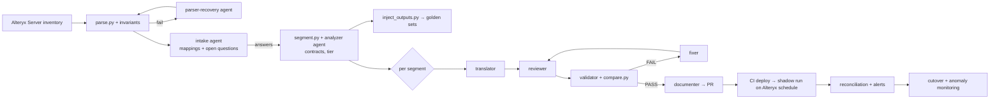

# Alteryx → Snowflake Migration — Plan & Architecture

An orchestrator + custom-agent pipeline on **GitHub Copilot CLI / Copilot SDK** that converts Alteryx workflows into Snowflake stored procedures, proves parity against golden data, shadow-runs them in production on the Alteryx schedule, and hands over with documentation and monitoring.

Three files make up the spec:

| File | Contents |
|------|----------|
| **00-README.md** (this file) | §1–4 principles, glossary, architecture, repo layout · §5 intake/plan mode · §6 parsing & parser fallback · §7 segmentation & golden data · §8 cookbook & parity edge cases · §9 validation · §10 production shadow run & anomaly detection · §11 governance · §12 build plan |
| [01-copilot-setup.md](01-copilot-setup.md) | Part A: `config.json` (mirrors your `/fleet` settings), repo instructions, the nine `.agent.md` definitions · Part B: the SDK orchestrator — state machine, loops, hooks, skeleton code |
| [02-schemas-reference.md](02-schemas-reference.md) | Every JSON/YAML/MD artifact the agents and scripts exchange |

## 1. Principles (non-negotiable)

1. **Parity first, modernize later.** Migrate like-for-like: same outputs, same grain, same schedule. Refactor to incremental loads or dynamic tables only after cutover. Mixing both makes validation impossible.
2. **Code does everything deterministic; agents only translate, classify, diagnose.** Parsing, segmentation, comparison, deployment and scheduling are scripts. No LLM ever computes a diff or a row count.
3. **Files and a manifest are the bus.** Subagents run in isolated contexts with no shared chat history, so every hand-off is a file path in the repo. Every stage is resumable from `manifest.json`.
4. **Every loop is bounded and every unknown escalates.** Parse recovery ×2, fix iterations ×3, then a human. Agents never invent table paths or tool semantics.
5. **Least privilege by role, enforced in code.** Read-only agents can only write their own report; only the validator executes SQL, and only in `MIG_*` schemas; nothing deploys from an agent session.

## 2. Glossary

| Term | Meaning |
|------|---------|
| Workflow | One Alteryx `.yxmd` / `.yxwz` (app) / `.yxmc` (macro), identified by `<wf_id>` |
| DAG | `parsed/dag.json`: tools as nodes, connections as edges with output anchors (Join L/J/R, Filter T/F …) |
| Segment | A contiguous sub-DAG (≈15–40 tools) translated as one procedure; boundaries materialize as work tables |
| Contract | `contract.json` for a segment: input/output schemas, keys, row relation, ordering keys, tolerances |
| Golden set | Captured Alteryx inputs + intermediates + outputs for one run, used as the parity oracle |
| Tier | T1 pure SQL · T2 needs Snowpark Python · T3 manual (Run Command, Python/R tool, spatial, fuzzy, API, email/render outputs) |
| Cookbook | `cookbook/<tool>.md`: the tested Alteryx-tool → Snowflake pattern plus known parity risks |
| Shadow run | The Snowflake procedure running on the Alteryx schedule into `__SHADOW` tables while Alteryx still owns production |
| Manifest | `workflows/<wf_id>/manifest.json`: status per stage, tier, segments, metrics, approvals |

## 3. Architecture



Everything left of the PR runs under the SDK orchestrator ([Setup Part B](01-copilot-setup.md)); everything right of it is CI plus Snowflake tasks ([Plan §10](00-README.md)).

## 4. Repository layout

```
migration/
├── .github/
│   ├── agents/                 # custom agents (01)
│   └── copilot-instructions.md # repo-wide rules every session sees
├── config.json                 # copy to COPILOT_HOME (01)
├── orchestrate.ts              # SDK outer loop (02)
├── scripts/
│   ├── parse.py                # yxmd XML → dag.json (04)
│   ├── parsers/ext/            # extension registry used by parser-recovery (04)
│   ├── invariants.py           # structural checks; failure triggers recovery (04)
│   ├── segment.py              # DAG cuts → segments/, order.json (05)
│   ├── inject_outputs.py       # instrument a workflow to capture golden data (05)
│   ├── compile_check.py        # sandbox compile of a segment (07)
│   └── compare.py              # deterministic diff → validation.json (07)
├── cookbook/                   # one page per Alteryx tool (06)
├── mappings/global.yaml        # program-wide answers (03)
├── tests/
│   ├── parser_corpus/          # fixtures for every XML variant ever seen (04)
│   └── cookbook_examples/      # regression cases per cookbook pattern (07)
├── snowflake/                  # RUN_LOG, RECON_RESULTS, tasks, alerts DDL (08)
└── workflows/<wf_id>/
    ├── source/                 # original .yxmd (+ macros), credentials scrubbed
    ├── parsed/                 # dag.json, parse_report.json, parse_diagnosis.md
    ├── intake/                 # mappings.yaml, open_questions.md, plan.md
    ├── segments/seg_NN/        # dag.json, contract.json, proc.sql, review.json, validation.json, fix_log.md
    ├── segments/order.json     # waves of segments that can run in parallel
    ├── golden/{inputs,intermediates,outputs}/
    ├── docs/migration.md
    ├── audit.jsonl
    └── manifest.json
```

## 5. Intake / plan mode

### 1. Purpose

Establish every fact a translator would otherwise have to guess — most importantly *"this Input tool reads `\\fin\gl_2024.yxdb`; which Snowflake table is that?"* — before any SQL is written. Intake never translates. Its outputs are `intake/mappings.yaml`, `intake/open_questions.md`, `intake/plan.md` and `manifest.status.intake`.

### 2. Touchpoints intake must enumerate (from `dag.json`)

| Category | What to capture | Typical Snowflake equivalent |
|----------|-----------------|------------------------------|
| Input Data: `.yxdb` | path, field names/types from the yxdb header (see §3), record count if present | a table already loaded, or a new ingestion job |
| Input Data: csv / xlsx | path, delimiter, header row, sheet, code page, type inference | external stage + `COPY INTO`, Snowpipe, or already landed |
| Input Data: DB / alias / ODBC | alias, connection string (scrubbed), embedded SQL | same table via a Snowflake mirror, or a dialect-translated query |
| In-DB tools | connection, SQL fragments | often lift near-verbatim |
| Dynamic Input | template + the field driving it | dynamic SQL or a frozen list |
| Download tool | URL, method, auth | external access integration, or a separate ingestion job (usually T3) |
| Output Data | target, write mode, pre-SQL, post-SQL, field mapping | table + `INSERT` / `MERGE` / `CREATE OR REPLACE`, pre/post kept as statements |
| Email / Render / Tableau / file outputs | destination | out of scope for a procedure → notification integration or downstream tool |
| Run Command / Python / R tools | script | T3 |
| Macros | path, type (standard/batch/iterative), interface params | shared procedure/UDF; batch → set-based; iterative → recursive CTE / WHILE |
| Workflow constants, user constants, app parameters (Interface tools) | name, default, where used | procedure arguments with defaults |
| Engine and locale | AMP vs E1, date/number formats, time zone | session parameters |

### 3. Proposing candidates instead of asking blind

1. Field list: `.yxdb` files carry their field metadata in the header (an XML `RecordInfo` block); `parse.py` extracts it without Alteryx. For DB inputs use the embedded SQL; otherwise take the nearest downstream Select/Join/Formula field references.
2. Query `INFORMATION_SCHEMA.COLUMNS` (read-only role) for tables whose column set covers those fields; rank by overlap; also score name similarity between the file name tokens and table names.
3. Present the top 3 with evidence: `FINANCE.RAW.GL_LEDGER (13/14 columns, missing POSTING_FLAG)`.
4. Row-count sanity when available: compare the yxdb record count with `TABLES.ROW_COUNT`.

### 4. `open_questions.md` format

```markdown
# Open questions — wf_0042 (owner: @jdoe)

## Blocking (translation waits)
- [ ] Q1 · Tool 12 Input Data reads `\\fin\gl_2024.yxdb` (14 fields, 1.2M rows).
      Proposed: `FINANCE.RAW.GL_LEDGER` (13/14 columns match; missing POSTING_FLAG). Confirm FQN or supply another: ________
- [ ] Q2 · Tool 88 Output Data writes `dbo.GL_SUMMARY` with mode "Update; Insert if new" on keys (ACCT, PERIOD).
      Proposed: `ANALYTICS.CURATED.GL_SUMMARY` via MERGE on (ACCT, PERIOD). Confirm keys and target: ________

## Non-blocking (proceeds with the assumption)
- [ ] Q3 · Tool 30 DateTimeNow() — assume session TIMEZONE = America/New_York (program default). Override: ________
```

A checked box with text after the colon is an answer; the orchestrator re-runs intake, which merges answers into `mappings.yaml` and promotes reusable ones to `mappings/global.yaml`. Unchecked blocking items keep the workflow in `WAITING_FOR_ANSWERS`; the orchestrator opens one GitHub issue per workflow with this file as the body.

### 5. Program-level policy questions (asked once, stored in `mappings/global.yaml`)

Target database/schema/warehouse · work and golden schemas · owning role · `EXECUTE AS OWNER` vs `CALLER` · column-name policy (sanitize to UPPER_SNAKE vs keep quoted) · float/timestamp tolerances · session time zone and `WEEK_START` · schedule source (Alteryx Server) and trigger strategy · accepted diff classes · notification channel.

### 6. `mappings/global.yaml` template

```yaml
# Program-wide answers. The intake agent reads this first and only asks about what is missing.
program:
  target_database: ANALYTICS
  target_schema: CURATED
  work_schema: MIG_WORK
  golden_schema: MIG_GOLDEN
  warehouse: MIG_WH
  owner_role: MIGRATION_ROLE
  execute_as: OWNER            # or CALLER, per workflow override allowed
  column_name_policy: sanitize # sanitize -> UPPER_SNAKE; quote -> keep Alteryx names quoted
session:
  TIMEZONE: America/New_York   # Alteryx DateTimeNow() used the server's local zone
  WEEK_START: 1
tolerances:
  float_abs: 1e-6
  float_rel: 1e-9
  timestamp_precision: milliseconds
accepted_diff_classes: [ROUNDING, ORDERING]   # anything else is a FAIL until a human accepts it

# Reusable source mappings, keyed by normalized Alteryx source (lower-case, share prefix stripped) or alias.
sources:
  "fin/gl_2024.yxdb":
    snowflake: FINANCE.RAW.GL_LEDGER
    load_path: snowpipe               # how the data gets to Snowflake: snowpipe | external_stage | already_there
    confirmed_by: jdoe
  "alias:PROD_ORACLE":
    snowflake_database: ORACLE_MIRROR
outputs: {}
```

Workflow-level `intake/mappings.yaml` has the same `sources:` / `outputs:` shape plus `constants:`, `parameters:` and `macros:` blocks; anything confirmed there that other workflows could reuse is promoted to the global file with `confirmed_by`.

### 7. `plan.md` contents

Tier and reasons · proposed segment cuts (tool id ranges, why) · unsupported/manual tools · parity risks by tool id · estimated fix-loop budget · dependencies on other workflows (shared macros, upstream outputs) · owner and consumers.

### 8. Statuses

`READY` · `WAITING_FOR_ANSWERS` · `BLOCKED` (a touchpoint cannot exist in Snowflake, e.g. Run Command) · `NEEDS_HUMAN` (contradictory answers).

## 6. Parsing & parser fallback

### 1. Alteryx file anatomy (what `parse.py` must handle)

```xml
<AlteryxDocument yxmdVer="2023.1">
  <Nodes>
    <Node ToolID="12">
      <GuiSettings Plugin="AlteryxBasePluginsGui.DbFileInput.DbFileInput"> ... </GuiSettings>
      <Properties>
        <Configuration> ... tool-specific XML; SQL often inside CDATA ... </Configuration>
        <Annotation> ... </Annotation>
        <MetaInfo connection="Output"><RecordInfo><Field name="ACCT" type="V_String" size="20"/>...</RecordInfo></MetaInfo>
      </Properties>
      <EngineSettings EngineDll="AlteryxBasePluginsEngine.dll" EngineDllEntryPoint="AlteryxDbFileInput"/>
    </Node>
    <Node ToolID="40">                      <!-- Tool Container -->
      <GuiSettings Plugin="AlteryxGuiToolkit.ToolContainer.ToolContainer"/>
      <ChildNodes> <Node ToolID="41">...</Node> ... </ChildNodes>   <!-- nested: recurse -->
    </Node>
    <Node ToolID="55"> <EngineSettings Macro="Supporting_Macros\clean.yxmc"/> </Node>   <!-- macro: resolve & parse recursively -->
  </Nodes>
  <Connections>
    <Connection>
      <Origin ToolID="12" Connection="Output"/>
      <Destination ToolID="20" Connection="Left"/>      <!-- anchors: Join Left/Right → L/J/R; Filter True/False; Unique U/D -->
    </Connection>
  </Connections>
  <Properties>
    <Constants> <Constant><Name>User.Region</Name><Value>EMEA</Value></Constant> </Constants>
    <RuntimeProperties> ... AMP engine flag ... </RuntimeProperties>
  </Properties>
</AlteryxDocument>
```

| File | Notes |
|------|-------|
| `.yxmd` | workflow; the normal case |
| `.yxwz` | analytic app; same body plus Interface tools → parameters |
| `.yxmc` | macro; Interface tools define inputs; batch/iterative flags in `<Properties>` |
| `.yxzp` | zip package containing a workflow and its dependencies; unzip to `source/` first |
| locked / encrypted | cannot be parsed → `QUARANTINED`, tier T3, ask the owner for the unlocked original |

`MetaInfo/RecordInfo` blocks are gold: they give the field schema at every anchor as Alteryx last saved it, which feeds intake candidate matching and segment contracts without running Alteryx.

### 2. `scripts/parse.py` spec

- **Input:** `workflows/<id>/source/*.yxm*` (+ referenced macros). **Output:** `parsed/dag.json`, `parsed/parse_report.json`.
- Recurse into `<ChildNodes>`; record `container_id` on each node.
- Resolve macros relative to the workflow, parse them recursively, and emit a `macro` node with `sub_dag` and `interface` (its parameters). Unresolvable path → `unresolved: true`, never dropped.
- Normalize anchors: map `Left/Right/Join/True/False/Unique/Dupes/...` to canonical names; record `out_anchors` per tool type.
- Extract per tool: `type` (canonical, from a Plugin → type table), `plugin`, `config` (parsed into a dict, raw XML kept as `raw_config`), `annotation`, `meta` (RecordInfo per anchor).
- Scrub credentials: connection strings and passwords in Input/Output/In-DB configs are replaced with `<scrubbed:alias>` and the alias recorded in `parse_report.json` for intake.
- Extract workflow constants, AMP flag, Output pre/post SQL, embedded SQL (CDATA), Formula expressions verbatim.
- **Extension registry:** `scripts/parsers/ext/*.py` modules call `register_plugin(plugin_name, handler)` and `register_element(tag, handler)`; the core loops over registered handlers before its defaults. This is the only surface `parser-recovery` may touch.
- `--check` runs `invariants.py` and exits non-zero on any violation.

`dag.json` schema is in [Schemas](02-schemas-reference.md#dagjson).

### 3. `scripts/invariants.py`

Cheap, structural, and the trigger for the fallback. Semantics are the analyzer's job.

```python
"""Invariants that parse.py --check enforces on dag.json. Any failure -> parse_report.json status INVARIANT_VIOLATION,
which is what triggers the parser-recovery agent. Keep these cheap and structural; semantics are the analyzer's job."""
import json, re, sys, pathlib

def check(xml_text: str, dag: dict) -> list[str]:
    errs = []
    nodes = {n["tool_id"]: n for n in dag["nodes"]}
    # 1. every <Node ToolID="..."> in the XML (including ones nested in containers/macros) is in dag.json
    xml_ids = set(re.findall(r'<Node\s+ToolID="(\d+)"', xml_text))
    missing = xml_ids - set(map(str, nodes))
    if missing: errs.append(f"nodes in XML but not in dag: {sorted(missing)[:10]}")
    # 2. every connection resolves to a known node and a known anchor
    for c in dag["edges"]:
        for side in ("src", "dst"):
            if str(c[side]) not in map(str, nodes): errs.append(f"edge {c} references unknown node on {side}")
        src = nodes.get(c["src"]) or nodes.get(str(c["src"]))
        if src and c.get("src_anchor") and c["src_anchor"] not in src.get("out_anchors", [c["src_anchor"]]):
            errs.append(f"edge {c} uses unknown anchor {c['src_anchor']} on tool {c['src']}")
    # 3. plugin recognized or explicitly marked unknown (never silently dropped)
    for n in dag["nodes"]:
        if n.get("type") is None: errs.append(f"tool {n['tool_id']} has no type (plugin {n.get('plugin')})")
    # 4. macros referenced are resolved to files or flagged
    for n in dag["nodes"]:
        if n.get("type") == "macro" and not (n.get("macro_path") or n.get("unresolved")):
            errs.append(f"macro tool {n['tool_id']} has no path")
    # 5. no orphan Input/Output tools lost their config (paths / connections must be non-empty)
    for n in dag["nodes"]:
        if n.get("type") in ("input", "output") and not n.get("config", {}).get("source"):
            errs.append(f"{n['type']} tool {n['tool_id']} has empty source/target")
    # 6. DAG is acyclic (Alteryx iterative macros are the only legal cycle, and they live inside a macro node)
    indeg = {k: 0 for k in nodes}
    for c in dag["edges"]: indeg[c["dst"]] = indeg.get(c["dst"], 0) + 1
    seen, frontier = 0, [k for k, v in indeg.items() if v == 0]
    adj = {}
    for c in dag["edges"]: adj.setdefault(c["src"], []).append(c["dst"])
    while frontier:
        k = frontier.pop(); seen += 1
        for d in adj.get(k, []):
            indeg[d] -= 1
            if indeg[d] == 0: frontier.append(d)
    if seen != len(nodes): errs.append("cycle detected outside a macro")
    return errs

if __name__ == "__main__":
    wf = pathlib.Path("workflows") / sys.argv[1]
    xml_text = next(wf.glob("source/*.yxm*")).read_text(encoding="utf-8", errors="replace")
    dag = json.loads((wf / "parsed" / "dag.json").read_text())
    errs = check(xml_text, dag)
    report = {"status": "OK" if not errs else "INVARIANT_VIOLATION", "errors": errs, "node_count": len(dag["nodes"])}
    (wf / "parsed" / "parse_report.json").write_text(json.dumps(report, indent=2))
    print(json.dumps(report, indent=2)); sys.exit(0 if not errs else 1)
```

Add invariants as new failure modes appear (e.g. "every Join node has exactly two inbound edges", "every Output node's target is non-empty after scrubbing").

### 4. Fallback: the `parser-recovery` agent

**Trigger.** `parse_report.json` status `FAILED` (exception) or `INVARIANT_VIOLATION`. Also trigger when the share of `unknown` nodes exceeds 10% of the workflow — the parse "succeeded" but the standard path clearly doesn't understand this file.

**Why an agent, not more code.** The corpus of Alteryx variants (versions since 10.x, custom tools from the Alteryx marketplace, in-house .NET/Python SDK tools, macro conventions per team) is open-ended. The agent's job is *diagnose → smallest extension → prove with tests*, and the registry keeps it from touching the core.

**Procedure** (full prompt in [Setup Part A §4](01-copilot-setup.md#4-agent-definitions-githubagentsagentmd)):
1. Diagnose first and write `parsed/parse_diagnosis.md` with the exact XML fragment. Classes: unknown Plugin (custom/third-party tool), structure (`ChildNodes`, macro-embedded workflows, renamed elements between `yxmdVer`s), packaging (`.yxzp`, `.yxwz`, locked), encoding (BOM, cp1252, namespaces, CDATA).
2. Extension in `scripts/parsers/ext/<name>.py`; never edit `parse.py`.
3. Fixture in `tests/parser_corpus/<name>/` (sanitized fragment) + test asserting invariants; run the whole corpus — every earlier fixture must still pass.
4. If a node is structurally parsed but semantically opaque → `type: "unknown"`, `raw_config` kept, `behavior` (plain-language description) + `confidence`. The analyzer decides; nobody invents semantics.
5. Report `RECOVERED` (attempt, extension) or `QUARANTINED` (reason).

**Limits.** 2 attempts per workflow (orchestrator-enforced). No deleting tests. No writes outside `ext/` and the corpus. The extension ships in the workflow's PR and a human reviews it; the corpus is the permanent regression gate.

**Second line of defense.** Even a subtly wrong parse (e.g. a mis-mapped anchor) is caught downstream: the analyzer sees a contract that doesn't fit, or the validator sees a diff at the first segment boundary. Golden intermediates ([Plan §7.5](00-README.md#5-golden-data)) make that localization possible.

## 7. Segmentation, contracts & golden data

### 1. Why segment

A 300-tool workflow translated in one shot fails in three ways: the translator's context fills with tools it isn't working on, a single diff at the end cannot be localized, and one bad CTE forces a rewrite of everything. Segments give each translator a small DAG plus a contract, and give validation a boundary to bisect against.

### 2. Cut heuristics (`scripts/segment.py`)

Cut at, in priority order:
1. **Tool Containers** — the author's own grouping; keep them intact unless oversized.
2. **Output Data / Browse / Block Until Done / Cache** tools — natural materialization points.
3. **Macro boundaries** — every macro instance is its own segment (or a shared procedure if the macro is shared).
4. **Graph bridges** — a single edge whose removal disconnects the DAG (everything upstream feeds only that edge).
5. **Connected components** — independent streams become separate procedures.

Then merge/split until each segment is ~15–40 tools, and:
- never split an ordering dependency (Sort → Multi-Row Formula / Sample / Record ID / Running Total / Unique stay together);
- never split a Join from both of its inputs' final projection;
- Formula-heavy segments (long expressions, Multi-Field/Multi-Row) get a lower tool cap (~20).

Outputs: `segments/seg_NN/dag.json` (sub-DAG with `inbound` / `outbound` edge lists) and `segments/order.json` (waves for parallel execution). The analyzer reviews and may adjust, recording reasons.

### 3. Contracts

`segments/seg_NN/contract.json` (schema in [Schemas](02-schemas-reference.md#contractjson)):

- `inputs[]`: `{ from: "FINANCE.RAW.GL_LEDGER" | "seg_02", columns: [{name, type, nullable}], keys, expected_rows: {min,max} }`
- `output`: `{ table: "MIG_WORK.WF0042_SEG_03_OUT", columns: [...], keys }`
- `row_relation`: `1:1 | filter | aggregate | expand` relative to the primary input
- `ordering`: keys used by order-dependent tools, and whether Alteryx order was itself deterministic
- `tolerances`: overrides of `global.yaml`
- `parity_risks[]`: `{tool_id, class, note}`

Contracts are the hand-off between segments and between agents: the translator honors them, the reviewer checks them, the validator asserts them.

### 4. Materialization

- Segment output → transient table `MIG_WORK.<WF>_<SEG>_OUT` in test; in production the same tables live in a work schema and are recreated per run (or skipped for 1:1 segments that can be inlined once parity is proven).
- `procs/master.sql` calls segment procedures in `order.json` order, passing `SRC_DB`, `SRC_SCHEMA`, `RUN_ID`.
- Each segment procedure sets session parameters first (`TIMEZONE`, `WEEK_START`, query tag = `wf:<id>;seg:<nn>;run:<run_id>`).

### 5. Golden data

Golden data is the parity oracle and the reason validation is trustworthy.

**Capture (`scripts/inject_outputs.py`).** Clone the workflow XML and insert Output Data tools writing Parquet (or CSV with explicit types) (a) after every Input Data tool, (b) at every segment cut point, (c) at every final output. Run the instrumented copy once with `AlteryxEngineCmd.exe`. Captured inputs remove source drift between systems; intermediates let a failure be bisected to one segment.

**Sets to capture per workflow.**
| Set | Purpose |
|-----|---------|
| `normal` | a typical run |
| `period_end` | month/quarter-end paths |
| `empty` | empty or near-empty inputs |
| `edge` | synthetic rows: nulls in every column, duplicates, unicode, max-length strings, leap day, DST boundary, negative zero, extreme decimals |

Edge rows are proposed by the analyzer and generated by a script; run Alteryx on them like any other set.

**Load.** `MIG_GOLDEN.<WF>_<SET>_IN_<toolid>`, `..._MID_<seg>`, `..._OUT_<toolid>` with explicit types from the yxdb/Parquet schema. Record the set list in `manifest.golden_sets`.

**Rules.** Golden data is immutable once loaded; if it's wrong, capture a new set with a new name. Agents may read but never write `golden/`.

### 6. Context budget rules

A translator prompt contains: the segment `dag.json`, its `contract.json`, the cookbook pages for the tool types present, `mappings.yaml`, and (on repeat passes) the last `review.json` / `validation.json`. Nothing else. The analyzer is the only agent that sees a whole workflow, and only through `dag.json` — never the raw XML (parser-recovery is the exception).

## 8. Cookbook & parity edge cases

The cookbook is the translator's and fixer's only source of tool semantics. One page per Alteryx tool, each with the same structure, each backed by a regression example in `tests/cookbook_examples/<tool>/`.

### 1. Page template (`cookbook/<tool>.md`)

```markdown
# <Tool name>  (plugin: <Plugin id>)
## What Alteryx does (precisely, incl. nulls, order, case, truncation)
## Snowflake pattern  (SQL, with placeholders)
## Parity risks  (numbered; each references an example under tests/cookbook_examples)
## Config fields that change the pattern
## Do not  (known wrong translations)
```

### 2. Tool → Snowflake map

| Alteryx tool | Snowflake construct | Parity notes |
|--------------|---------------------|--------------|
| Input Data | table / stage + `COPY INTO` | types from yxdb header; CSV code page, header row, delimiter; Excel sheet & inferred types |
| Output Data | `INSERT` / `MERGE` / `CREATE OR REPLACE` | write mode; pre/post SQL; field mapping by name vs position; "Update; Insert if new" → `MERGE` on the configured keys |
| Select | projection + `CAST` + rename | fixed-width `String(n)` → `LEFT(x,n)`; deselected fields drop; type changes may truncate/round |
| Filter | `WHERE` (True) / `WHERE NOT (…) OR (…) IS NULL` (False) | rows evaluating to NULL go to the **False** output |
| Formula | expression per column, sequential | later expressions see earlier results in the *same* tool (chain CTEs or nest); see §4 function map |
| Multi-Field Formula | same expression over N columns | generated per column; `_CurrentField_` semantics |
| Multi-Row Formula | window functions (`LAG/LEAD`) with `ORDER BY` + `PARTITION BY` group | "Num rows" lookback; behavior for unknown rows (null vs 0); requires deterministic order |
| Join | `INNER JOIN` (J) + anti-joins (L, R) | equi-join only; duplicate names get `Right_` prefix; case/trim behavior verified empirically per version |
| Union | `UNION ALL` with name-or-position alignment | "auto config by name" vs by position; output order not guaranteed |
| Summarize | `GROUP BY` | `Count` vs `CountNonNull`; `Concat` separator/quote/nulls; `First/Last` are order-dependent; percentiles interpolation |
| Cross Tab | `PIVOT` | dynamic header set → dynamic SQL or frozen list; header sanitization rules; aggregation method |
| Transpose | `UNPIVOT` | key columns kept; null handling in value column |
| Unique | `QUALIFY ROW_NUMBER() … = 1` | which row is "first" depends on incoming order; case-sensitivity |
| Sort | `ORDER BY` | only meaningful when a downstream tool is order-dependent; null placement; dictionary vs binary order |
| Sample | `QUALIFY ROW_NUMBER()` / `LIMIT` | first/last/skip N, 1 of every N, random → needs seed policy |
| Record ID | `ROW_NUMBER() OVER (ORDER BY …)` | starting value; requires deterministic order |
| Running Total | `SUM() OVER (ORDER BY … ROWS UNBOUNDED PRECEDING)` | group-by fields; order |
| Tile | `NTILE` / `WIDTH_BUCKET` | equal records vs equal sum vs manual cutoffs |
| Append Fields | `CROSS JOIN` | warning thresholds in Alteryx; verify cardinality |
| Find Replace | `REPLACE` / lookup join | whole-word, case-insensitive options; first match wins |
| Text to Columns | `SPLIT_PART` / `SPLIT_TO_TABLE` | to columns vs to rows; extra-chars behavior |
| RegEx | `REGEXP_REPLACE` / `REGEXP_SUBSTR` | Perl vs Snowflake regex dialect; case-insensitive flag; tokenize mode |
| DateTime | `TO_DATE` / `TO_TIMESTAMP` / `TO_CHAR` | format strings differ; two-digit years; invalid → null + warning |
| Data Cleansing | `TRIM`, `REGEXP_REPLACE`, `COALESCE` | each option maps to a separate transform; "replace nulls with 0/blank" changes downstream semantics |
| Dynamic Rename / Dynamic Select | frozen at migration time, or dynamic SQL | schema must be known; flag as parity risk |
| Dynamic Input | dynamic SQL loop or `IN (…)` rewrite | template SQL with replaced strings |
| In-DB tools | SQL lifted near-verbatim | dialect translation if source wasn't Snowflake |
| Batch macro | set-based rewrite (join on control parameter) | loop only if unavoidable |
| Iterative macro | recursive CTE or `WHILE` with max iterations | termination condition |
| Interface tools / app params | procedure arguments | defaults; question types |
| Block Until Done / Control Container | statement ordering in the procedure | no semantic effect otherwise |
| Download / Run Command / Python / R / Email / Render / Spatial / Fuzzy Match | T2 (Snowpark) or T3 | Fuzzy Match may approximate with `JAROWINKLER_SIMILARITY`/`EDITDISTANCE` but never claims parity |

### 3. Type map

| Alteryx | Snowflake | Notes |
|---------|-----------|-------|
| Bool | BOOLEAN | Alteryx True/False from strings: "T", "Y", "1" rules |
| Byte, Int16/32/64 | NUMBER(38,0) | overflow behavior |
| FixedDecimal(p,s) | NUMBER(p,s) | Alteryx rounds on conversion; scale must match |
| Float / Double | FLOAT | tolerance-compared only |
| String(n) | VARCHAR(n) | Alteryx truncates silently; Snowflake errors → `LEFT()` |
| WString(n) / V_String / V_WString | VARCHAR | encoding; max size |
| Date / Time / DateTime | DATE / TIME / TIMESTAMP_NTZ | Alteryx has no tz; decide NTZ + session TIMEZONE |
| Blob / SpatialObj | BINARY / GEOGRAPHY | T2/T3 |

### 4. Formula function map (excerpt — extend as encountered)

| Alteryx | Snowflake |
|---------|-----------|
| `ToString(x)` / `ToNumber(x)` | `TO_VARCHAR(x)` / `TRY_TO_NUMBER(x)` (warn-and-null semantics) |
| `IIF(c,a,b)` / `IF … THEN … ELSEIF … ENDIF` | `IFF` / `CASE` |
| `Contains(s,t)` / `StartsWith` / `EndsWith` | `CONTAINS` / `STARTSWITH` / `ENDSWITH` (case-sensitivity flags!) |
| `PadLeft(s,n,c)` | `LPAD` |
| `Trim` / `TrimLeft` / `TrimRight` | `TRIM` / `LTRIM` / `RTRIM` |
| `Round(x, m)` | `ROUND(x / m) * m` — verify half-even vs half-away behavior per build |
| `DateTimeParse(s, fmt)` / `DateTimeFormat` | `TRY_TO_TIMESTAMP(s, fmt')` / `TO_CHAR` with translated format tokens |
| `DateTimeAdd(d, n, 'days')` / `DateTimeDiff` | `DATEADD` / `DATEDIFF` (units, sign convention) |
| `DateTimeNow()` / `DateTimeToday()` | `CURRENT_TIMESTAMP` / `CURRENT_DATE` under the agreed `TIMEZONE` |
| `REGEX_Replace` / `REGEX_Match` | `REGEXP_REPLACE` / `REGEXP_LIKE` (dialect) |
| `IsNull` / `IsEmpty` | `IS NULL` / `NULLIF(TRIM(x),'') IS NULL` |
| `Substring(s, start, len)` | `SUBSTR(s, start+1, len)` (0- vs 1-based) |
| `Length` / `Uppercase` / `Lowercase` / `TitleCase` | `LENGTH` / `UPPER` / `LOWER` / `INITCAP` |
| `Mod` / `Ceil` / `Floor` / `Abs` / `Pow` | same names, check integer vs float promotion |
| `Random()` / `RandInt` | `UNIFORM(…, RANDOM(seed))` — never parity; flag |

### 5. Edge cases that break parity (checklist for analyzer risk flags)

**Types & numbers**
- Fixed-width `String(n)` truncation vs `VARCHAR(n)` error.
- `ToNumber` on bad input: null + warning in Alteryx → `TRY_TO_NUMBER`.
- Rounding mode and FixedDecimal scale; double precision → tolerances only.
- Integer division and type promotion in Formula.
- Bool parsing from strings.

**Nulls & strings**
- Filter sends NULL evaluations to the False branch.
- Summarize `Count` vs `CountNonNull`; `Concat` skips nulls.
- String concat with null; `IsEmpty` treats whitespace-only differently from `IS NULL`.
- Case sensitivity in Join / Unique / Summarize / Find Replace / `Contains`: verify per tool per version; Snowflake is case-sensitive by default (collation can be set per column).
- Trailing spaces and unicode normalization.

**Order**
- Sample, Record ID, Unique first-row, Running Total, Multi-Row Formula, Summarize First/Last, Tile all depend on incoming order.
- AMP engine can change record order vs the original engine — some Alteryx outputs are already nondeterministic; document and add explicit ordering.

**Dates & locale**
- `DateTimeNow()` uses the Alteryx server's local time zone.
- Format token translation; two-digit years; invalid dates → null.
- DST boundaries; `WEEK_START`; fiscal calendars from macros.
- Locale-dependent number parsing (comma decimals).

**Inputs & outputs**
- Excel: header row, sheet, inferred types, merged cells; CSV: code page, delimiter, quoted newlines.
- Output pre/post SQL; write modes; field mapping by name vs position; output to the same table the workflow reads (self-reference → run ordering).
- Workflows chained by files (workflow A writes a yxdb workflow B reads) → dependency edges between workflows.

**Dynamic & macro**
- Dynamic Rename/Select/Input need a known schema; freeze or dynamic SQL, always flagged.
- Batch macros: set-based rewrite; iterative macros: recursion cap; shared macros migrated once.
- Interface defaults and app parameters.

**Column names**
- Spaces/special characters; sanitize vs quote policy decided once (downstream consumers depend on names).
- Join duplicate-name prefixes; Cross Tab header sanitization rules.

## 9. Validation

### 1. Layers

| Layer | Tool | Catches |
|-------|------|---------|
| Static review | `reviewer` agent | missing CTEs, ordering, casts, contract mismatch, unsafe SQL — before any execution |
| Compile check | `scripts/compile_check.py` | creates the procedure in `MIG_WORK` and `EXPLAIN`s each CTE chain; best-effort since some Snowflake Scripting errors are runtime-only |
| Segment parity | `validator` + `compare.py` on golden intermediates | logic errors localized to one segment |
| End-to-end parity | same, on golden outputs via `master.sql` | integration of segments, write modes, pre/post SQL |
| Idempotency | run twice on the same golden set | non-deterministic functions, append-mode bugs |
| Performance | query tag → `QUERY_HISTORY` | runtime, credits, join explosions, spills |
| Regression | nightly + on cookbook/shared-macro change | drift introduced by later fixes |

### 2. `scripts/compare.py` spec

```
compare.py --expected <parquet|table> --actual <table> --contract contract.json --out validation.json
           [--tolerances global.yaml] [--sample-rows 5]
```

Checks, in order, stopping early only on schema failure:
1. **Schema**: column names (after the agreed name policy), types (by family), nullability.
2. **Counts**: rows, and per-column null count / distinct count.
3. **Aggregates** per numeric column: sum, min, max, avg (tolerance-aware); per string column: min/max length, sample of distinct values.
4. **Set difference** both directions on the key columns (`EXCEPT`), then key-based column diffs with a per-column mismatch count.
5. **Row-level diff** where no key exists: hash of the normalized row (`HASH_AGG`-style) — reports counts only.
6. **Tolerances**: `float_abs`/`float_rel`, timestamp precision, explicit string normalizations (trim, case) — every normalization applied is written to the report; nothing is silent.

Output `validation.json` ([schema in Schemas reference](02-schemas-reference.md#validationjson)): verdict, per-check results, diff clusters `{class, columns, count, example_rows}`, runtime/credits, idempotency result, normalizations applied. Exit code 0 PASS, 1 FAIL, 2 error.

Diff classes the validator labels: `ROUNDING`, `ORDERING`, `NULL_SEMANTICS`, `TRUNCATION`, `TYPE`, `LOGIC`, `GOLDEN_DATA`, `UNKNOWN`. Only classes listed in `global.yaml.accepted_diff_classes` can yield `PASS_WITH_ACCEPTED_DIFF`, and each accepted instance is recorded with an approver in `manifest.accepted_diffs` (documented by `documenter`).

### 3. Verdict rules

- `PASS`: zero diffs after declared tolerances.
- `PASS_WITH_ACCEPTED_DIFF`: all diff clusters in accepted classes and each has a human approval (first occurrence per workflow needs sign-off; later runs inherit it).
- `FAIL`: anything else. The validator names the most likely CTE; the fixer gets one iteration.
- `needs_human`: the diff points at golden data, the contract, or mappings rather than SQL.

### 4. Regression suite

- Golden sets and validated procedures persist forever (`MIG_GOLDEN` + repo).
- Trigger a re-run of every `PASS`ed workflow whose segments use tool X when `cookbook/X.md` changes, and of every workflow using a shared macro procedure when it changes; nightly full run for the rest.
- `tests/cookbook_examples/<tool>/` holds minimal input/expected pairs per cookbook pattern; run on every cookbook PR.
- Any regression reopens the workflow at `translate` with the failing segment only.

## 10. Production: shadow run, cutover & anomaly detection

Answer to "should the pipeline keep a copy output table on the Alteryx schedule?": **yes** — that is the shadow run, and it is the only way to prove parity on live data before cutover. After cutover the Alteryx oracle is gone, so monitoring must stand on its own; design both from the start.

### 1. Deployment

- Procedures reach Snowflake only through CI (schemachange or Snowflake CLI) from the PR the pipeline opened. Never from an agent session.
- Environments: `DEV` (agents), `TEST` (regression), `PROD_SHADOW`, `PROD`. Same procedure body, different `SRC_*` parameters and target schema.
- Every procedure sets `QUERY_TAG = 'wf:<id>;seg:<nn>;run:<run_id>;sha:<git>'` so cost and errors are attributable.

### 2. Objects

```sql
-- one row per procedure execution
CREATE TABLE OPS.RUN_LOG (
  RUN_ID STRING, WF_ID STRING, PROC_VERSION STRING, MODE STRING,        -- SHADOW | PROD
  STARTED_AT TIMESTAMP_LTZ, ENDED_AT TIMESTAMP_LTZ, STATUS STRING, ERROR STRING,
  INPUT_SNAPSHOT_TS TIMESTAMP_LTZ,                                       -- time-travel point used for inputs
  INPUT_COUNTS VARIANT, OUTPUT_COUNTS VARIANT, KEY_AGGREGATES VARIANT,   -- per table/column
  CREDITS FLOAT, WAREHOUSE STRING
);
-- one row per reconciliation
CREATE TABLE OPS.RECON_RESULTS (
  RUN_ID STRING, WF_ID STRING, TARGET_TABLE STRING, CHECKED_AT TIMESTAMP_LTZ,
  VERDICT STRING, ROW_DELTA NUMBER, ONLY_IN_ALTERYX NUMBER, ONLY_IN_SNOWFLAKE NUMBER,
  COLUMN_MISMATCHES VARIANT, EXAMPLES VARIANT
);
-- shadow output lives beside the real one
CREATE TABLE ANALYTICS.CURATED.GL_SUMMARY__SHADOW LIKE ANALYTICS.CURATED.GL_SUMMARY;
```

### 3. Same input state for both systems

Pick one per workflow (record it in `manifest.production.trigger`):

| Strategy | How | When to use |
|----------|-----|-------------|
| Event-triggered + Time Travel | Alteryx Server completion event (Server API / webhook → event table or external function) starts the Snowflake task; the procedure reads sources `AT(TIMESTAMP => :alteryx_start_ts)` | sources are Snowflake tables (most cases) |
| Shared snapshot | a task snapshots inputs into `STAGE_SNAPSHOT.<table>_<run_id>`; Alteryx (repointed) and the procedure both read it | Alteryx reads Snowflake directly and can be repointed cheaply |
| Same-cron, tolerance window | both fire on the same cron; recon tolerates rows with `LOAD_TS` inside the overlap window | file/DB sources outside Snowflake where drift is small |

If Alteryx reads files or non-Snowflake DBs, the Alteryx output itself is loaded to Snowflake (Output tool already does, or a small extra Output) so recon is table-vs-table.

### 4. Reconciliation task

Runs after both sides complete (the event, or a fixed delay after the cron). Same logic as `compare.py` expressed in SQL:

```sql
-- counts + full-row hash on both sides; EXCEPT both ways on keys; column-level mismatch counts
INSERT INTO OPS.RECON_RESULTS
SELECT :run_id, 'wf_0042', 'GL_SUMMARY', CURRENT_TIMESTAMP(),
       IFF(a.n = s.n AND a.h = s.h, 'PASS', 'FAIL'), s.n - a.n, ...
FROM (SELECT COUNT(*) n, HASH_AGG(*) h FROM ANALYTICS.CURATED.GL_SUMMARY) a,
     (SELECT COUNT(*) n, HASH_AGG(*) h FROM ANALYTICS.CURATED.GL_SUMMARY__SHADOW) s;
```

`CREATE ALERT` on `RECON_RESULTS.VERDICT = 'FAIL'` → notification integration (email/Slack/Teams). Alerts include the diff examples so the fixer loop can be rerun with a new golden set captured from that day.

### 5. Exit criteria and cutover

- **Exit**: N consecutive clean reconciliations (suggest 10 daily cycles or 3 weekly ones) **including at least one period-end**, no `FAIL` within tolerances, runtime and credits within budget, owner sign-off recorded in `manifest.production.signoff`.
- **Cutover**: `ALTER TABLE GL_SUMMARY SWAP WITH GL_SUMMARY__SHADOW` inside a transaction (or repoint a view); switch the task from `SHADOW` to `PROD` mode; pause — do not delete — the Alteryx schedule; repoint downstream consumers (found during inventory) and notify them.
- **Rollback window**: keep the paused Alteryx job and the previous table for two cycles; rollback = swap back + resume schedule.
- **Decommission**: after the window, archive the Alteryx workflow in the repo (`source/`) and remove its Server schedule.

### 6. After cutover: standalone anomaly detection

Once Alteryx is gone the shadow table becomes the *previous run* snapshot, and monitoring uses history:

| Check | Source | Rule |
|-------|--------|------|
| Row counts, key aggregates | `RUN_LOG` history | rolling median ± k·MAD (k = 3) per workflow, per weekday if seasonal |
| Null rates, distinct counts, value ranges | data metric functions on the output table | drift vs 30-run baseline |
| Freshness | `RUN_LOG.ENDED_AT` | SLA per workflow from the Alteryx schedule |
| Input schema | assertion at procedure start against `contract.json` | fail fast; Alteryx would have silently mis-mapped |
| Run-over-run diff | `OUTPUT` vs `__SHADOW` (previous run) | changed-row ratio outside expected band |
| Cost | `QUERY_HISTORY` by query tag | credits per run outside band |
| Failures | `RUN_LOG.STATUS` | any ERROR |

All feed `CREATE ALERT`s and a dashboard over `RUN_LOG` / `RECON_RESULTS`. Thresholds live in `mappings/global.yaml.monitoring` with per-workflow overrides in the manifest.

### 7. Runbook items per workflow (`docs/migration.md`)

How to run manually with parameters · where inputs come from and the trigger · how to re-run a day · rollback steps · owner and consumers · known accepted differences · alert routing.

## 11. Enterprise governance

### 1. Security

- **Roles.** `MIGRATION_AGENT` (used by the MCP server): `USAGE` on `MIG_WORK`/`MIG_GOLDEN`, read on `INFORMATION_SCHEMA`, nothing on production. `MIGRATION_CI` deploys. `MIGRATION_RUN` executes in production (`EXECUTE AS OWNER` unless the workflow needs caller context).
- **Credentials never reach a model.** `parse.py` scrubs connection strings and passwords from XML before anything is written to `workflows/<id>/source/`; `onPostToolUse` flags any secret-shaped text in tool results; the Snowflake MCP uses key-pair auth from a secrets manager.
- **Sandbox for shell tools.** Agents' shell access runs in a container with a network allowlist (Snowflake endpoint, GitHub, package registries) and the repo as the only writable mount.
- **PII.** Masking and row-access policies are re-applied to migrated output tables as part of deployment; golden sets containing PII live only in `MIG_GOLDEN` with the same policies, or are synthesized.
- **Prompt injection.** Anything read from workflows (annotations, embedded SQL, comments) and from Snowflake is data, not instructions; the repo instructions say so and reviewers check for it.

### 2. Governance

- **Change control.** Every workflow ships as one PR: procedures, contracts, validation reports, docs, parser extensions. Required reviewers: data owner + platform.
- **Accepted-differences register.** `manifest.accepted_diffs[]` with class, example, approver, date; surfaced in `docs/migration.md` and a program-level roll-up.
- **Lineage.** CTE-per-tool naming with tool ids preserves Alteryx lineage in SQL; Snowflake `ACCESS_HISTORY` provides table lineage; optionally emit OpenLineage events from `RUN_LOG`.
- **Documentation.** `documenter` output is the handover artifact; nothing is cut over without it.
- **Retention.** Original workflows, golden sets and audit logs retained for the program's life plus audit period.

### 3. Human gates

| Gate | Who | Artifact |
|------|-----|----------|
| Intake answers | workflow owner | `open_questions.md` / GitHub issue |
| Plan approval for T2/T3 | migration lead | `plan.md` |
| Accepted difference | owner | `manifest.accepted_diffs` |
| Parser extension | platform | PR review of `scripts/parsers/ext/` |
| Cookbook change | migration lead | proposal PR + regression green |
| Deploy to shadow | platform | PR merge |
| Cutover | owner + platform | `manifest.production.signoff` |

### 4. Cost

- Premium requests: `manifest.metrics` per stage → cost per workflow per tier; tune model routing in `config.json` from real numbers (e.g. move reviewer to `effortLevel: low` if its findings are stable).
- Snowflake: warehouse per environment; validator sessions on an XS warehouse with auto-suspend; credits per run from query tags; alert on runaway queries.
- Budgets and kill switches in the orchestrator ([Setup Part B §6](01-copilot-setup.md#6-parallelism-and-budgets)).

### 5. Observability

- `workflows/<id>/audit.jsonl` — every tool call and result summary per role.
- SDK OpenTelemetry instrumentation → the platform's tracing backend (session duration, tool latency, errors).
- Program dashboard built from all `manifest.json` files: workflows per stage, first-pass parity rate, fix iterations, NEEDS_HUMAN queue, cost per workflow.

### 6. Pipeline KPIs

| KPI | Target | Use |
|-----|--------|-----|
| First-pass parity rate (PASS on iteration 1) | ↑ over time | cookbook quality |
| Mean fix iterations | ↓ | prompt/cookbook tuning |
| NEEDS_HUMAN rate by cause | ↓ | where to invest (parser, intake, cookbook) |
| Premium requests per workflow by tier | within budget | model routing |
| Time from intake to PR | ↓ | throughput planning |
| Regression failures per cookbook change | ~0 | cookbook proposal quality |

### 7. Team roles

Migration lead (priorities, plan approvals, cookbook merges) · platform engineer (orchestrator, CI, Snowflake objects, security) · Alteryx SME (golden capture, semantics questions, intake answers triage) · data owners (mappings, accepted diffs, cutover sign-off).

## 12. Build plan

First week: copy `config.json` and the agent files into place (Setup Part A), hand-migrate 3–5 small workflows (they become the first golden sets and cookbook pages), then build `parse.py`, `invariants.py` and `compare.py` against them. Do not start the translator until `compare.py` is trusted.

Work top-down; each milestone has a definition of done that the next one depends on. Tick boxes in VS Code as you go.

### M0 — Foundations (week 1)
- [ ] Repo skeleton per [Plan §4](00-README.md#4-repository-layout); `.github/copilot-instructions.md`
- [ ] `config.json` in `COPILOT_HOME`; agent files in `.github/agents/`; confirm they load (`/agents`)
- [ ] Snowflake: `MIG_WORK`, `MIG_GOLDEN`, `OPS` schemas; `MIGRATION_AGENT` role; MCP server wired with key-pair auth
- [ ] Alteryx: `AlteryxEngineCmd.exe` runnable from a build box; Server API access for inventory
- [ ] Pick 5 small workflows spanning Input/Filter/Formula/Join/Summarize/Output and hand-migrate them (these are the seed golden sets and cookbook pages)
- **Done when:** an interactive `@intake` session runs against one workflow and produces `open_questions.md`.

### M1 — Deterministic spine (weeks 2–3)
- [ ] `parse.py` + extension registry + `invariants.py`; corpus with the 5 seed workflows ([Plan §6](00-README.md))
- [ ] `segment.py` producing `segments/` and `order.json` ([Plan §7](00-README.md))
- [ ] `inject_outputs.py`; capture `normal` golden sets for the 5 seeds; load to `MIG_GOLDEN`
- [ ] `compare.py` with `validation.json` output; prove it on the hand-migrated procedures, including a deliberately broken one ([Plan §9](00-README.md))
- [ ] `compile_check.py`
- **Done when:** `compare.py` reports PASS on the 5 hand migrations and FAIL with the right cluster class on the broken one. Do not proceed until this is trusted.

### M2 — Agents on T1 (weeks 3–5)
- [ ] Cookbook v1: pages for the ~15 most common tools ([Plan §8](00-README.md)), each with a `tests/cookbook_examples` case
- [ ] `orchestrate.ts` with hooks, permission policy, manifest, parse-recovery loop, intake wait state, fix loop ([Setup Part B](01-copilot-setup.md))
- [ ] Run end-to-end on the 5 seeds unattended; measure premium requests and credits per workflow
- [ ] Add 10 new T1 workflows; iterate cookbook via `cookbook-curator` proposals
- **Done when:** first-pass parity ≥ 60% on new T1 workflows and every failure lands in `NEEDS_HUMAN` with a usable diagnosis.

### M3 — Robustness (weeks 5–7)
- [ ] Force parser failures (custom tool XML, nested containers, `.yxzp`) and verify `parser-recovery` produces extensions + corpus tests
- [ ] `period_end`, `empty`, `edge` golden sets; idempotency and performance checks in the validator
- [ ] Regression suite triggers (cookbook change, shared macro change, nightly)
- [ ] T2 path: Snowpark Python translation for Multi-Row-heavy and macro-heavy segments
- **Done when:** a batch of 30 workflows runs overnight and resumes cleanly after a forced crash.

### M4 — Production shadow run (weeks 7–10)
- [ ] CI deploy (schemachange / Snowflake CLI) from PRs; environment promotion
- [ ] `RUN_LOG`, `RECON_RESULTS`, `__SHADOW` tables, tasks, alerts ([Plan §10](00-README.md))
- [ ] Trigger strategy per workflow (event + Time Travel by default)
- [ ] First 5 workflows in shadow; dashboard over `RUN_LOG` / `RECON_RESULTS`
- **Done when:** 10 clean cycles incl. a period-end on one workflow, cutover rehearsed and rolled back.

### M5 — Scale (ongoing)
- [ ] Inventory-driven backlog from Alteryx Server (retire unused, tier, shared macros first)
- [ ] Post-cutover anomaly detection on every cut-over workflow
- [ ] KPIs reviewed weekly ([Plan §11.6](00-README.md#6-pipeline-kpis)); model routing and concurrency tuned from real cost

### Verify against your CLI / SDK build

These are version-dependent; check before relying on them.
- [ ] Custom agent names accepted under `subagents.agents` in `config.json` (fallback: frontmatter `model:`)
- [ ] Valid `effortLevel` values (`high`?) and `contextTier` values
- [ ] Frontmatter keys the CLI loads (`name`, `description`, `model` string, `tools` list format)
- [ ] SDK `createSession` option names (`workingDirectory`, `mcpServers` shape, `customAgents`), `sendAndWait` signature, `client.stop()`
- [ ] Exact `toolName` values seen in `onPreToolUse` (log once, then tighten regexes)
- [ ] `onPostToolUse` return shape for replacing/redacting a result
- [ ] Whether subagents spawned inside an SDK session can see files the parent spilled to a session temp dir (they run as separate sessions; keep hand-offs in the repo)
- [ ] Alteryx: `AlteryxEngineCmd.exe` licensing on the build box; Server API version for schedules/events
- [ ] Snowflake: notification integration type available; Data Metric Functions enabled; Time Travel retention on source tables ≥ run gap

### Risks

| Risk | Mitigation |
|------|------------|
| Alteryx outputs that are already nondeterministic (AMP ordering) | detect in analyzer; explicit ordering; accepted `ORDERING` class with sign-off |
| Sources not yet in Snowflake (files, other DBs) | intake `load_path` field; ingestion is its own workstream, tracked in the manifest |
| Premium-request cost from parallel subagents | budgets and kill switches; measure before scaling concurrency |
| Cookbook change regresses earlier migrations | regression suite scoped by tool; curator proposals only |
| Owners slow to answer intake | defaults + non-blocking questions; GitHub issue SLAs; program-level answers reused |
| Custom/locked workflows | parser-recovery, quarantine to T3, SME queue |
