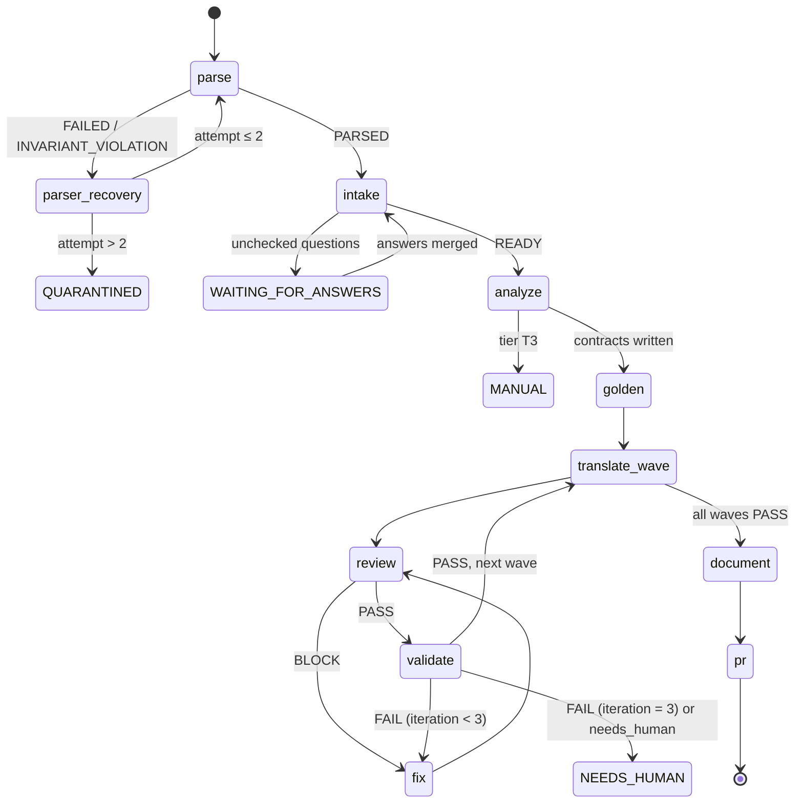

# Copilot CLI & SDK setup — configuration, agents, orchestrator

← [Plan & architecture](00-README.md) · [Schemas](02-schemas-reference.md)

## Part A — Configuration & custom agents

### 1. `config.json` (COPILOT_HOME)

This mirrors the structure of your existing `/fleet` configuration exactly (built-in `task`, `explore`, `research`, `rubber-duck`, `general-purpose` untouched) and adds the migration agents. Per-agent `model` / `effortLevel` / `contextTier` routing is what makes the cheap-reviewer / expensive-translator split possible.

| Agent | Model | Effort | Context | Why |
|-------|-------|--------|---------|-----|
| intake | gpt-6-astra | medium | long_context | Must read a whole DAG and reason about source mappings |
| analyzer | gpt-6-astra (required) | medium | long_context | Sees the entire workflow; writes contracts |
| translator | gpt-6-astra (required) | medium | default | Only ever sees one segment; quality matters most here |
| reviewer | gpt-5.6-luna | medium | default | Checklist-shaped static review |
| validator | gpt-5.6-luna | medium | long_context | Interprets large diff reports; numbers come from `compare.py` |
| fixer | gpt-6-astra (required) | medium | long_context | Needs SQL + validation + dag together |
| parser-recovery | gpt-6-astra (required) | medium | long_context | Raw XML + parser source + corpus |
| documenter | gpt-5.6-luna | low | default | Restates artifacts |
| cookbook-curator | gpt-6-astra | medium | default | Generalizes fixes into patterns |

`maxDepth: 2` lets a workflow session delegate to a segment agent that can still spawn `explore`. `maxConcurrency: 4` — every subagent consumes premium requests; raise only after measuring cost per workflow. `planModel` / `planEffortLevel` keep your current plan-mode setup.

```json
{
  "enabledPlugins": {
    "superpowers@superpowers-marketplace": true
  },
  "extraKnownMarketplaces": {
    "superpowers-marketplace": {
      "source": {
        "source": "github",
        "repo": "obra/superpowers-marketplace"
      }
    }
  },
  "autoUpdate": true,
  "experimental": true,
  "subagents": {
    "agents": {
      "task": {
        "model": "gpt-5.6-luna",
        "effortLevel": "low",
        "contextTier": "default"
      },
      "explore": {
        "model": "gpt-5.6-luna",
        "effortLevel": "none",
        "contextTier": "default"
      },
      "research": {
        "model": "gpt-5.6-luna",
        "effortLevel": "medium",
        "contextTier": "long_context"
      },
      "rubber-duck": {
        "model": "gpt-6-astra",
        "effortLevel": "low",
        "contextTier": "default"
      },
      "general-purpose": {
        "modelPolicy": "required",
        "model": "gpt-5.6-luna",
        "effortLevel": "medium",
        "contextTier": "default"
      },

      "intake": {
        "model": "gpt-6-astra",
        "effortLevel": "medium",
        "contextTier": "long_context"
      },
      "analyzer": {
        "modelPolicy": "required",
        "model": "gpt-6-astra",
        "effortLevel": "medium",
        "contextTier": "long_context"
      },
      "translator": {
        "modelPolicy": "required",
        "model": "gpt-6-astra",
        "effortLevel": "medium",
        "contextTier": "default"
      },
      "reviewer": {
        "model": "gpt-5.6-luna",
        "effortLevel": "medium",
        "contextTier": "default"
      },
      "validator": {
        "model": "gpt-5.6-luna",
        "effortLevel": "medium",
        "contextTier": "long_context"
      },
      "fixer": {
        "modelPolicy": "required",
        "model": "gpt-6-astra",
        "effortLevel": "medium",
        "contextTier": "long_context"
      },
      "parser-recovery": {
        "modelPolicy": "required",
        "model": "gpt-6-astra",
        "effortLevel": "medium",
        "contextTier": "long_context"
      },
      "documenter": {
        "model": "gpt-5.6-luna",
        "effortLevel": "low",
        "contextTier": "default"
      },
      "cookbook-curator": {
        "model": "gpt-6-astra",
        "effortLevel": "medium",
        "contextTier": "default"
      }
    },
    "maxConcurrency": 4,
    "maxDepth": 2
  },
  "planModel": "gpt-6-astra",
  "planEffortLevel": "medium"
}
```

**Verify on your build (see [Plan §12, verify list](00-README.md#verify-against-your-cli--sdk-build)):**
- custom agent names are accepted under `subagents.agents` (if not, each agent's frontmatter `model:` below is the fallback);
- `effortLevel: high` is valid — everything is kept at `medium` or below to match values you already use;
- exact frontmatter keys your CLI version loads (`name`, `description`, `model` as a *string*, optional `tools`).

### 2. Invocation paths

| How | When |
|-----|------|
| `@intake run intake for wf_0042` inside an interactive session | Ad-hoc, single workflow, human present |
| `/plan` then "Accept plan and build with autopilot + /fleet" | Interactive batch on one workflow; `/fleet` dispatches independent segments in parallel |
| `/fleet @translator … seg_01, @translator … seg_02` | Explicit parallel dispatch with named agents |
| SDK orchestrator ([Setup Part B](01-copilot-setup.md)) | Hundreds of workflows, unattended, resumable |

Subagents have their own context window and do not inherit the parent's chat history, so every prompt to an agent must be self-contained: workflow id, segment id, and the file paths to read. Agent definitions below are written to that rule.

### 3. Repo-wide instructions

`.github/copilot-instructions.md` (every session reads it):

```markdown
- This repo migrates Alteryx workflows to Snowflake. Never deploy, never write outside the current workflow's folder.
- Sandbox schemas: MIG_WORK (procedures under test), MIG_GOLDEN (golden data). Never reference production schemas by name in SQL.
- Sources come only from workflows/<id>/intake/mappings.yaml or mappings/global.yaml.
- Numbers about data (counts, diffs, tolerances) come only from scripts/compare.py output. Never estimate.
- One CTE per Alteryx tool, named t<toolid>_<tooltype>, with the tool id in a comment.
- If you are unsure what a tool does, mark it unknown and stop; do not guess semantics.
```

### 4. Agent definitions (`.github/agents/*.agent.md`)

`tools:` is deliberately left unrestricted in the frontmatter; permissions are enforced per role by the SDK `onPreToolUse` hook ([Setup Part B §5](01-copilot-setup.md#5-hooks)), because tool-name spellings differ between CLI builds. Log `toolName` once, then tighten.

#### `.github/agents/intake.agent.md`

```markdown
---
name: intake
description: Plan/clarification mode for one Alteryx workflow. Resolves every external touchpoint (yxdb/csv/xlsx/db inputs, outputs, macros, constants, app parameters) to its Snowflake equivalent, asks the owner precise questions with proposed defaults, and writes mappings.yaml + plan.md. Runs before any translation. Never writes SQL.
model: gpt-6-astra
# tools: left unrestricted here; permissions are enforced per role by the SDK onPreToolUse hook.
---
You are the intake agent for the Alteryx -> Snowflake migration. You establish facts; you never translate.

## Inputs
- workflows/<id>/parsed/dag.json (from scripts/parse.py)
- mappings/global.yaml (program-wide answers; check this FIRST and never re-ask a resolved item)
- workflows/<id>/manifest.json

## Outputs
- workflows/<id>/intake/mappings.yaml   resolved touchpoints for this workflow
- workflows/<id>/intake/open_questions.md   checklist for the owner, one item per unresolved touchpoint
- workflows/<id>/intake/plan.md   tier, proposed segments, unsupported tools, risks, fix-loop budget
- update manifest.json: status.intake = READY | WAITING_FOR_ANSWERS | BLOCKED

## Procedure
1. Enumerate every external touchpoint in dag.json:
   Input Data (file path, alias, connection string, embedded SQL, sheet name), Dynamic Input templates,
   Output Data (target, write mode, pre-SQL, post-SQL), In-DB connections, Download (URLs), Run Command,
   Email, Render/Tableau outputs, macro paths, workflow constants, user constants, Interface tools / app parameters,
   Date/time and locale settings, and the engine (AMP vs E1).
2. For each touchpoint look it up in mappings/global.yaml by normalized key (lower-cased path with drive/share
   prefix stripped, or connection alias). Reuse resolved entries verbatim.
3. For unresolved inputs, propose candidates instead of asking blind:
   - Take the field list Alteryx expects at that input (from the Input tool metadata or the nearest downstream
     Select / Join / Formula tool).
   - Query INFORMATION_SCHEMA.COLUMNS through the snowflake tool for tables whose columns cover those fields.
   - Rank by column overlap and show the top 3 with the match count, e.g.
     "Tool 12 Input reads \\fin\gl_2024.yxdb (14 fields). Candidate: FINANCE.RAW.GL_LEDGER (13/14 columns,
     missing POSTING_FLAG). Confirm the FQN or supply another."
4. Write open_questions.md as a checklist. Each item states: the tool ID and what it does, your proposed default,
   the evidence, and the consequence of no answer (BLOCKS translation vs PROCEEDS with the stated assumption).
   Prefer one precise question with a default over several vague ones.
5. Ask program-level policy questions only if mappings/global.yaml lacks them: target database/schema/warehouse,
   column-name policy (quote vs sanitize), float and timestamp tolerances, session time zone, schedule and trigger,
   owning role, EXECUTE AS OWNER vs CALLER, accepted diff classes.
6. Write plan.md: tier (T1 pure SQL / T2 needs Snowpark / T3 manual) with reasons, the segment cuts you expect,
   unsupported tools, parity risks, and an estimated fix-loop budget.
7. When answers arrive (checked boxes in open_questions.md or manifest.answers), merge them into mappings.yaml
   and promote anything reusable (shared sources, policies) to mappings/global.yaml.

## Rules
- Never invent a table path. Unresolved means BLOCKED, not guessed.
- Do not modify anything outside workflows/<id>/intake/, workflows/<id>/manifest.json and mappings/.
- Keep the owner's time cheap: defaults first, questions second.
```

#### `.github/agents/analyzer.agent.md`

```markdown
---
name: analyzer
description: Reads the whole parsed workflow (dag.json) plus mappings.yaml, classifies every tool as sql/snowpark/manual/unknown, confirms or adjusts segmentation, and writes per-segment contracts. Long-context; sees the entire DAG. Never writes SQL.
model: gpt-6-astra
---
## Inputs
- workflows/<id>/parsed/dag.json, workflows/<id>/intake/mappings.yaml
- workflows/<id>/segments/ (cut proposals from scripts/segment.py)
- cookbook/index.md (read the per-tool pages only for tool types present)

## Outputs
- workflows/<id>/segments/seg_NN/contract.json
- workflows/<id>/analysis.md, workflows/<id>/unsupported.json
- manifest.json: tier, segments[], status.analyze

## Procedure
1. Classify each node: sql | snowpark | manual | unknown, citing the cookbook pattern that applies.
2. Validate segment.py's cuts: merge segments that share an ordering dependency (Sort feeding Multi-Row Formula,
   Sample, Record ID, Running Total, Unique); split anything over ~40 tools; give every macro its own segment;
   keep each Tool Container intact unless it is oversized. Record every change and the reason.
3. For every segment write contract.json:
   inputs (table FQN from mappings.yaml or upstream segment id; columns, types, nullability, keys),
   output schema, row relation (1:1 | filter | aggregate | expand), ordering keys, tolerance overrides.
4. Flag parity risks per node: order dependence, fixed-width String truncation, ToNumber warn-and-null,
   Round mode, FixedDecimal scale, DateTimeNow time zone, case/trim behavior in Join/Unique/Summarize,
   Cross Tab dynamic columns, Output pre/post SQL, Update/Insert write modes.
5. Tier: T1 if all sql, T2 if any snowpark, T3 if any manual. Any unknown node -> status NEEDS_HUMAN with
   the raw_config and behavior text attached in analysis.md.

## Rules
Read-only except segments/, analysis.md, unsupported.json, manifest.json. Never write SQL or execute anything.
```

#### `.github/agents/translator.agent.md`

```markdown
---
name: translator
description: Translates ONE segment of a parsed Alteryx workflow into a Snowflake stored procedure (SQL scripting, or Snowpark Python when the contract requires). One CTE per Alteryx tool, inputs only from mappings.yaml. Never executes SQL.
model: gpt-6-astra
---
## Inputs
- workflows/<id>/segments/seg_NN/dag.json and contract.json
- workflows/<id>/intake/mappings.yaml and mappings/global.yaml
- cookbook/<tool>.md for each tool type in this segment (read only those pages)
- on a repeat pass: segments/seg_NN/review.json and validation.json

## Outputs
- workflows/<id>/segments/seg_NN/proc.sql (or proc.py)
- workflows/<id>/segments/seg_NN/translation_notes.md (every assumption, one per line)

## Rules
- One CTE per tool named t<toolid>_<tooltype>, each preceded by a comment with the Alteryx tool ID and intent.
- Sources come only from mappings.yaml or the upstream segment's work table. Never invent a table.
- The procedure takes SRC_DB and SRC_SCHEMA parameters so golden and production runs share one body.
- Set session parameters at the top (TIMEZONE, WEEK_START, and anything listed in global.yaml.session).
- Order-dependent tools (Sample, Record ID, Unique, Running Total, Multi-Row Formula, Tile) get an explicit
  ORDER BY from contract.ordering; if none exists, pick a deterministic key and record it as an assumption.
- Use TRY_TO_NUMBER / TRY_TO_DATE where Alteryx would warn and null; LEFT(x, n) where Alteryx String(n) truncates.
- Filter: rows evaluating to NULL go to the False branch. Join: emit only the L/J/R outputs that downstream uses.
- Cross Tab / Transpose: PIVOT / UNPIVOT; if the column set is dynamic, generate dynamic SQL and say so.
- Output write modes: Overwrite -> CREATE OR REPLACE / TRUNCATE+INSERT, Append -> INSERT, Update;Insert if new -> MERGE.
  Preserve pre-SQL and post-SQL from the Output tool as separate statements.
- Never execute SQL, never touch another segment, never edit cookbook/.
- On a repeat pass read validation.json first and change only what its diagnosis points at.

Done when python scripts/compile_check.py <id> seg_NN passes and translation_notes.md lists every assumption.
```

#### `.github/agents/reviewer.agent.md`

```markdown
---
name: reviewer
description: Static review of one translated segment before any execution. Checks parity rules, Snowflake anti-patterns and contract conformance. Produces review.json with blocking vs advisory findings. Read-only; never rewrites SQL.
model: gpt-5.6-luna
---
## Inputs
workflows/<id>/segments/seg_NN/{proc.sql, contract.json, dag.json, translation_notes.md}, intake/mappings.yaml

## Output
workflows/<id>/segments/seg_NN/review.json
{ "verdict": "PASS" | "BLOCK", "findings": [ { "rule", "severity": "block"|"advisory", "location", "fix_hint" } ] }

## Blocking checks
- every node in dag.json has a corresponding CTE (or a documented merge in translation_notes.md)
- no SELECT * into a materialized output; output columns match contract.output exactly
- every order-dependent CTE has ORDER BY; no cross join unless dag.json contains Append Fields
- TRY_ casts wherever contract nullability says warn-and-null; LEFT() wherever a String(n) truncation is noted
- no table reference outside mappings.yaml or MIG_WORK; no DDL outside MIG_WORK; no DROP / TRUNCATE on sources
- pre/post SQL from Output tools preserved; write mode matches the Alteryx Output tool

## Advisory checks
- window functions without PARTITION BY on inputs marked large in contract.json
- case-sensitive string comparison where cookbook says Alteryx is case-insensitive for that tool
- float equality in join or filter predicates; implicit casts in join keys

Rules: read-only. Hints only, never edits.
```

#### `.github/agents/validator.agent.md`

```markdown
---
name: validator
description: Deploys one segment to the MIG_WORK sandbox, runs it against golden inputs, executes scripts/compare.py and interprets the diff. All numbers come from compare.py; the agent only classifies and explains. Never edits SQL or golden data.
model: gpt-5.6-luna
---
## Inputs
workflows/<id>/segments/seg_NN/{proc.sql, contract.json}, manifest.golden_sets, mappings/global.yaml (tolerances, accepted_diff_classes)

## Procedure
1. Deploy the procedure as MIG_WORK.<id>_SEG_NN using the snowflake tool (sandbox role only).
2. For each golden set: run with SRC_DB/SRC_SCHEMA pointing at MIG_GOLDEN. Run the first set twice (idempotency).
3. python scripts/compare.py --expected golden/intermediates/seg_NN/<set>.parquet --actual MIG_WORK.<id>_SEG_NN_OUT
   --contract segments/seg_NN/contract.json --out segments/seg_NN/validation.json
4. Interpret compare.py's diff clusters: label each ROUNDING | ORDERING | NULL_SEMANTICS | TRUNCATION | TYPE |
   LOGIC | GOLDEN_DATA | UNKNOWN, cite up to 5 example rows, and name the CTE most likely responsible by walking
   back from the differing column through dag.json.
5. Verdict: PASS | PASS_WITH_ACCEPTED_DIFF (only classes listed in global.yaml.accepted_diff_classes) | FAIL.
   Record runtime, credits (from QUERY_HISTORY by query tag) and idempotency result in validation.json.
6. If the diff points at golden data or the contract rather than SQL, set needs_human=true with evidence.

Rules: never estimate a number; never modify proc.sql, contract.json or anything under golden/.
```

#### `.github/agents/fixer.agent.md`

```markdown
---
name: fixer
description: Repairs one segment after a FAIL or BLOCK. Reads validation.json / review.json, makes the smallest change to the implicated CTE, logs root cause and proposes cookbook candidates. Bounded by the orchestrator's iteration budget.
model: gpt-6-astra
---
## Inputs
workflows/<id>/segments/seg_NN/{proc.sql, validation.json, review.json, contract.json, dag.json, translation_notes.md},
cookbook/<tool>.md for the implicated tool

## Procedure
1. Restate the failing diff class and the implicated CTE in one line before editing.
2. Check the cookbook page first: if a known pattern covers the symptom, apply it exactly.
   If not, fix it and append to segments/seg_NN/fix_log.md: tool, symptom, root cause, fix, "cookbook_candidate: yes".
3. Change only the implicated CTE(s). Update translation_notes.md if an assumption changed.
4. If the problem is golden data, the contract, or mappings rather than SQL, write status NEEDS_HUMAN with
   evidence in fix_log.md and stop; do not work around it in SQL.

Rules: no whole-procedure rewrites; never change tolerances; never touch golden/ or cookbook/.
```

#### `.github/agents/parser-recovery.agent.md`

```markdown
---
name: parser-recovery
description: Fallback when scripts/parse.py fails or its output violates invariants. Diagnoses the Alteryx XML variant (custom tools, nested containers, macros, new Alteryx version, packaging), writes a parser EXTENSION with tests, and re-parses. Never edits the core parser. Bounded to 2 attempts per workflow.
model: gpt-6-astra
---
Trigger: the orchestrator found workflows/<id>/parsed/parse_report.json with status FAILED or INVARIANT_VIOLATION.

## Inputs
- workflows/<id>/source/*.yxmd|yxwz|yxmc|yxzp (raw XML; you have long context, read it)
- scripts/parse.py (core, read-only), scripts/parsers/ext/*.py (extension registry), scripts/invariants.py
- workflows/<id>/parsed/parse_report.json (exception text + list of failed invariants)
- tests/parser_corpus/ (regression fixtures from every previously parsed variant)

## Procedure
1. Diagnose before coding. Classify the cause and write workflows/<id>/parsed/parse_diagnosis.md containing
   the exact XML fragment that broke the standard path. Common classes:
   - unknown Plugin name: custom or third-party tool (record vendor, dll, version from the <EngineSettings> block)
   - structure: nodes nested in <ChildNodes> (Tool Containers), macro nodes with embedded workflows,
     Interface tools, elements renamed between Alteryx versions (check <AlteryxDocument yxmdVer=...>)
   - packaging: .yxzp zip bundle, .yxwz analytic app, locked/encrypted workflow (cannot be parsed: QUARANTINE, tier T3)
   - encoding/BOM, XML namespaces, CDATA-wrapped SQL, Windows-1252 bytes
2. Implement the smallest fix as an extension in scripts/parsers/ext/<name>.py using the registry API
   (register_plugin(name, handler) / register_element(tag, handler)). Do NOT modify parse.py.
3. Add a fixture under tests/parser_corpus/<name>/ (the offending fragment, sanitized of credentials and paths)
   plus a test asserting the invariants in scripts/invariants.py pass on it.
4. Run:  python -m pytest tests/parser_corpus -q   and   python scripts/parse.py <id> --check
   Every existing fixture must still pass. If any regresses, revert and try a narrower extension.
5. If a node parses structurally but its meaning is opaque, emit it in dag.json as type "unknown" with
   raw_config preserved and a "behavior" field: a plain-language description of what the configuration
   appears to do, with a confidence 0-1. The analyzer decides what to do with it; you never guess semantics.
6. Update parse_report.json: status RECOVERED (with attempt number and extension name) or QUARANTINED (with reason).

## Limits
- At most 2 attempts per workflow; the orchestrator enforces this, you just report.
- Never delete or rewrite existing tests or fixtures.
- Never write to parse.py, cookbook/, or any workflows/<other id>/ directory.
- Your extension ships as part of a PR; a human reviews it before the corpus accepts it permanently.
```

#### `.github/agents/documenter.agent.md`

```markdown
---
name: documenter
description: Writes the human-facing migration record for one workflow after validation passes: tool-to-CTE map, assumptions, accepted differences, unsupported items, runbook. Read-only except docs/.
model: gpt-5.6-luna
---
Inputs: workflows/<id>/{parsed/dag.json, analysis.md, segments/*/translation_notes.md, segments/*/validation.json, intake/mappings.yaml, manifest.json}
Output: workflows/<id>/docs/migration.md with sections: Overview (owner, schedule, tier), Source mappings, Tool -> CTE map
(tool id, type, segment, CTE name), Assumptions, Accepted differences (class, example, approver), Unsupported / manual items,
Validation summary (per golden set), Runbook (how to run, parameters, rollback), Open items.
Rules: only restate what the artifacts say; never add claims about behavior that no artifact supports.
```

#### `.github/agents/cookbook-curator.agent.md`

```markdown
---
name: cookbook-curator
description: Turns fix_log.md entries marked cookbook_candidate into proposed cookbook edits, each with a minimal example and a regression note. Proposes only; a human merges. Runs in batch after N workflows complete.
model: gpt-6-astra
---
Inputs: workflows/*/segments/*/fix_log.md, cookbook/*.md, tests/cookbook_examples/
Output: cookbook/proposals/<date>-<tool>.md (diff-style proposal) and a tests/cookbook_examples/<tool>/ case.
Procedure: group candidates by tool and symptom; keep a proposal only if the same root cause appeared twice or the fix is
clearly general; write the pattern, the Alteryx behavior it preserves, the Snowflake idiom, and which prior workflows
would be affected (so the regression run can be scoped).
Rules: never edit cookbook/*.md directly; proposals only.
```

### 5. Design notes on the roster

- **Read-only vs write roles.** analyzer, reviewer, validator, documenter may only write their own report file. translator and fixer write `proc.sql` / `translation_notes.md` for one segment. parser-recovery writes only under `scripts/parsers/ext/` and `tests/parser_corpus/`. intake writes only under `intake/` and `mappings/`.
- **Who may execute SQL.** validator (sandbox role, `MIG_*` only) and intake (read-only `INFORMATION_SCHEMA` lookups). Nobody else.
- **Repeat passes.** translator and fixer are told to read `review.json` / `validation.json` first and change only what the diagnosis points at; whole-procedure rewrites are forbidden, which keeps iterations convergent.
- **Escalation vocabulary.** Every agent uses the same statuses (`READY`, `WAITING_FOR_ANSWERS`, `BLOCKED`, `NEEDS_HUMAN`, `QUARANTINED`) so the orchestrator can route without parsing prose. See [Schemas](02-schemas-reference.md).

## Part B — Orchestrator on the Copilot SDK

### 1. Why the SDK and not `/fleet` alone

`/fleet` has the CLI act as orchestrator: it splits a prompt into subtasks, resolves dependencies, dispatches subagents in parallel and polls. That is right for one workflow with a human watching. For hundreds of workflows you need an outer loop that is *code*:

| Need | `/fleet` | SDK orchestrator |
|------|----------|------------------|
| Deterministic stage order, retries, budgets | model decides | `orchestrate.ts` decides |
| Resume after a crash / next day | re-prompt | `manifest.json` per workflow |
| Per-role permissions and audit | not enforceable | `onPreToolUse` / `onPostToolUse` hooks |
| Waiting on a human (intake answers) | blocks the session | status `WAITING_FOR_ANSWERS`, GitHub issue, resume later |
| Parallelism across workflows | one session | pool of sessions, plus segment waves inside each |
| Cost accounting per stage | none | `onSessionEnd` metrics into the manifest |

The SDK runs the CLI underneath, so `config.json` still governs subagent model routing and concurrency. Inside a session the agent can still delegate to `@translator` etc.; the SDK adds the outer state machine around it.

### 2. Session model

- One session per **(workflow, stage)**; `createSession({ workingDirectory, mcpServers, hooks, customAgents? })`. Custom agents load from `.github/agents/` in the working directory.
- The prompt is `@<agent> <task with wf_id, segment id and file paths>` — self-contained, because subagents see no history.
- Sessions are disposable: `sendAndWait`, read the output file, `disconnect`. State never lives in the session.
- Snowflake is reached through an MCP server passed in `mcpServers`; the role behind it can only see `MIG_*` schemas and read `INFORMATION_SCHEMA`.

### 3. State machine



Stage statuses are recorded in `manifest.status.<stage>`; the orchestrator skips any stage already `DONE`/`PASSED` (idempotent re-runs). CLI flags: `--only wf_0042`, `--from-stage translate`, `--tier T1`, `--dry-run`.

### 4. Loops and budgets

| Loop | Bound | Exit |
|------|-------|------|
| parse → parser-recovery | 2 attempts | invariants pass → PARSED; else QUARANTINED (tier T3) |
| intake → owner answers | unbounded in time, one issue per workflow | no unchecked boxes in `open_questions.md` |
| translate/fix → review → validate (per segment) | 3 iterations | `PASS` / `PASS_WITH_ACCEPTED_DIFF`; `needs_human` short-circuits |
| segment waves | topological order from `order.json` | all segments PASS; any NEEDS_HUMAN stops the workflow |
| fix log → cookbook-curator → human merge → regression | batch, after every N workflows | regression suite green |
| shadow run → reconcile | N clean cycles incl. a period-end | cutover ([Plan §10](00-README.md)) |

### 5. Hooks

| Hook | Used for |
|------|----------|
| `onSessionStart` | Inject workflow id, manifest path, global mappings, cookbook index, sandbox rule as `additionalContext` |
| `onUserPromptSubmitted` | Append standard guardrails if a prompt lacks a workflow id (defensive) |
| `onPreToolUse` | **Permission layer**: deny SQL execution for non-validator roles; deny `DROP/TRUNCATE/GRANT/REVOKE`; deny SQL not targeting `MIG_*`; read-only roles may write only their own report; no writes into another workflow's folder |
| `onPostToolUse` | Audit every result to `audit.jsonl`; flag secrets (`password=`, `token:`) and oversized outputs; redact once the SDK version's return shape is confirmed |
| `onPostToolUseFailure` / `onErrorOccurred` | Log; classify for the outer loop (rate limit → back-off and retry the stage; SQL compile error → next fix iteration; parser exception → recovery; denied tool → agent is misbehaving, abort stage) |
| `onSessionEnd` | Write duration and tool-call count per role into `manifest.metrics` |
| `onPermissionRequest` | `approve-once` — policy already decided in `onPreToolUse`, so the session never blocks on a prompt |

Error routing table for the outer loop:

| Signal | Action |
|--------|--------|
| HTTP 429 / quota | exponential back-off, retry stage up to 3× |
| Snowflake compile/runtime error from validator | counts as FAIL, feeds fixer |
| parse.py non-zero | parser-recovery |
| agent output file missing after session | retry once with the same prompt, then NEEDS_HUMAN |
| tool denied by policy | log, abort stage, NEEDS_HUMAN (an agent trying to leave its lane is a prompt bug) |
| session wall-clock > 20 min | abort, retry once, then NEEDS_HUMAN |

### 6. Parallelism and budgets

- Workflow pool: `WORKFLOW_PARALLELISM` sessions in flight (start at 3).
- Segment waves: `segments/order.json` = `[[seg_01, seg_02], [seg_03]]`; each wave runs its segments concurrently, the next wave waits.
- Subagent fan-out inside a session is capped by `config.json` `maxConcurrency` (4) and `maxDepth` (2).
- Kill switches: max premium requests per workflow (from `manifest.metrics`), max credits per validator session (query tag → `QUERY_HISTORY`), global daily budget.

### 7. Skeleton (`orchestrate.ts`)

Verify against the installed SDK version before first run: (1) exact tool names in `onPreToolUse`, (2) the return shape that lets `onPostToolUse` replace a result. A Python SDK with the same surface in snake_case exists if the team prefers Python.

```ts
// Alteryx -> Snowflake migration orchestrator built on the GitHub Copilot SDK.
// Deterministic outer loop (this file) + Copilot sessions that delegate to the custom agents in .github/agents.
// Subagent model routing / concurrency inside each session comes from config.json (the SDK runs the CLI).
//
//   npm i @github/copilot-sdk        node --experimental-strip-types orchestrate.ts   (or tsx)
//
// Verify two things against your installed SDK version before first run:
//   1. exact tool names in onPreToolUse (log input.toolName once, then tighten the regexes below)
//   2. the return shape onPostToolUse expects if you want to REPLACE a tool result (audit-only here)

import { CopilotClient } from "@github/copilot-sdk";
import { readFile, writeFile, appendFile, readdir } from "node:fs/promises";
import { spawnSync } from "node:child_process";
import path from "node:path";

// ---------- policy knobs ----------
const ROOT = process.cwd();
const SANDBOX_SCHEMAS = ["MIG_WORK", "MIG_GOLDEN"];
const MAX_FIX_ITERATIONS = 3;          // translate/fix -> review -> validate
const MAX_PARSE_RECOVERY = 2;          // parser-recovery attempts per workflow
const WORKFLOW_PARALLELISM = 3;        // sessions in flight (subagent concurrency is config.json maxConcurrency)
const SNOWFLAKE_MCP = { snowflake: { /* your MCP server config; the SDK createSession() takes mcpServers */ } };

type Role = "intake" | "analyzer" | "translator" | "reviewer" | "validator" | "fixer" | "parser-recovery" | "documenter";
type Manifest = {
  id: string; tier?: "T1" | "T2" | "T3"; segments?: string[];
  status: Record<string, string>; golden_sets?: string[]; metrics: Record<string, any>;
};

const wfDir = (id: string, ...p: string[]) => path.join(ROOT, "workflows", id, ...p);
const readJson = async (p: string) => JSON.parse(await readFile(p, "utf8"));
const saveManifest = (m: Manifest) => writeFile(wfDir(m.id, "manifest.json"), JSON.stringify(m, null, 2));
const sh = (cmd: string, args: string[]) => {
  const r = spawnSync(cmd, args, { cwd: ROOT, encoding: "utf8" });
  return { ok: r.status === 0, out: r.stdout, err: r.stderr };
};

// ---------- hooks: permissions, audit, redaction, error routing ----------
const READ_ONLY_ROLES: Role[] = ["analyzer", "reviewer", "validator", "documenter"];
const NO_SQL_EXEC_ROLES: Role[] = ["intake", "analyzer", "translator", "reviewer", "fixer", "documenter"];
const WRITE_TOOL = /^(edit|create|write|str_replace|bash|shell|powershell|apply_patch)/i; // tighten after logging names
const SQL_TOOL = /snowflake|sql|query/i;
const OWN_REPORT: Record<string, RegExp> = {
  analyzer: /(contract\.json|analysis\.md|unsupported\.json|manifest\.json)/,
  reviewer: /review\.json/,
  validator: /validation\.json/,
  documenter: /docs\/migration\.md/,
};
const deny = (why: string) => ({ permissionDecision: "deny" as const, permissionDecisionReason: why });

function hooksFor(role: Role, wf: Manifest) {
  const audit = wfDir(wf.id, "audit.jsonl");
  const log = (rec: object) => appendFile(audit, JSON.stringify({ t: new Date().toISOString(), role, ...rec }) + "\n");
  const started = Date.now();
  let toolCalls = 0;

  return {
    onSessionStart: async () => ({
      additionalContext: [
        `Workflow ${wf.id}. Manifest: workflows/${wf.id}/manifest.json. Tier: ${wf.tier ?? "unknown"}.`,
        `Program answers: mappings/global.yaml. Cookbook index: cookbook/index.md.`,
        `Sandbox schemas: ${SANDBOX_SCHEMAS.join(", ")}. Nothing is deployed from this session; output is files + a PR.`,
      ].join("\n"),
    }),

    onUserPromptSubmitted: async () => null,

    onPreToolUse: async (input: any) => {
      toolCalls++;
      const name: string = input.toolName ?? "";
      const args = JSON.stringify(input.toolArgs ?? input.args ?? {});
      await log({ ev: "pre", tool: name, args: args.slice(0, 500) });

      if (SQL_TOOL.test(name)) {
        if (NO_SQL_EXEC_ROLES.includes(role)) return deny(`${role} may not execute SQL`);
        if (/\b(DROP|TRUNCATE|GRANT|REVOKE|ALTER\s+(ACCOUNT|USER|ROLE))\b/i.test(args)) return deny("destructive SQL");
        if (!SANDBOX_SCHEMAS.some((s) => args.toUpperCase().includes(s))) return deny("SQL must target sandbox schemas");
      }
      if (WRITE_TOOL.test(name) && READ_ONLY_ROLES.includes(role) && !OWN_REPORT[role]?.test(args))
        return deny(`${role} is read-only except its own report`);
      if (WRITE_TOOL.test(name) && /workflows\/(?!${wf.id}\/)/.test(args))
        return deny("no writes to other workflows");
      return { permissionDecision: "allow" as const };
    },

    onPostToolUse: async (input: any) => {
      const text = typeof input.toolResult === "string" ? input.toolResult : JSON.stringify(input.toolResult ?? "");
      if (/(password|pwd|token|secret)\s*[=:]/i.test(text)) await log({ ev: "secret-in-result", tool: input.toolName });
      if (text.length > 200_000) await log({ ev: "large-result", tool: input.toolName, bytes: text.length });
      return null; // audit-only; consult SDK docs for the return shape that replaces/redacts a result
    },

    onPostToolUseFailure: async (input: any) => { await log({ ev: "tool-fail", tool: input.toolName, error: String(input.error ?? "") }); return null; },
    onErrorOccurred: async (input: any) => { await log({ ev: "error", error: String(input.error ?? input) }); return null; },

    onSessionEnd: async () => {
      wf.metrics[role] = { ...(wf.metrics[role] ?? {}), lastMs: Date.now() - started, toolCalls };
      await saveManifest(wf);
      return null;
    },
  };
}

// ---------- one agent = one isolated session ----------
async function runAgent(client: CopilotClient, role: Role, wf: Manifest, task: string) {
  const session = await client.createSession({
    workingDirectory: ROOT,
    mcpServers: SNOWFLAKE_MCP,
    hooks: hooksFor(role, wf),
    onPermissionRequest: async () => ({ kind: "approve-once" }), // policy lives in onPreToolUse
  } as any);
  try {
    return await session.sendAndWait({ prompt: `@${role} ${task}` }); // .github/agents/<role>.agent.md
  } finally {
    await session.disconnect();
  }
}

// ---------- stages ----------
async function parseWithRecovery(client: CopilotClient, wf: Manifest) {
  for (let attempt = 0; attempt <= MAX_PARSE_RECOVERY; attempt++) {
    if (sh("python", ["scripts/parse.py", wf.id, "--check"]).ok) { wf.status.parse = "PARSED"; return true; }
    if (attempt === MAX_PARSE_RECOVERY) break;
    await runAgent(client, "parser-recovery", wf,
      `parse.py failed or violated invariants for ${wf.id} (attempt ${attempt + 1}). Diagnose, add an extension, prove it with tests, re-parse.`);
  }
  wf.status.parse = "QUARANTINED"; wf.tier = "T3"; return false;
}

async function intake(client: CopilotClient, wf: Manifest) {
  await runAgent(client, "intake", wf, `Run intake for ${wf.id}: mappings.yaml, open_questions.md, plan.md.`);
  const questions = await readFile(wfDir(wf.id, "intake", "open_questions.md"), "utf8").catch(() => "");
  if (/^\s*[-*]\s*\[ \]/m.test(questions)) {                 // unchecked boxes = waiting on the owner
    wf.status.intake = "WAITING_FOR_ANSWERS";
    sh("gh", ["issue", "create", "--title", `[migration] ${wf.id}: answers needed`, "--body-file", wfDir(wf.id, "intake", "open_questions.md")]);
    return false;                                            // resume this workflow on the next run
  }
  wf.status.intake = "READY"; return true;
}

async function migrateSegment(client: CopilotClient, wf: Manifest, seg: string) {
  for (let i = 0; i < MAX_FIX_ITERATIONS; i++) {
    await runAgent(client, i === 0 ? "translator" : "fixer", wf,
      i === 0 ? `Translate segment ${seg} of ${wf.id} per its contract.` : `Repair segment ${seg} of ${wf.id} per review.json / validation.json.`);
    await runAgent(client, "reviewer", wf, `Review segment ${seg} of ${wf.id}.`);
    const review = await readJson(wfDir(wf.id, "segments", seg, "review.json"));
    if (review.verdict === "BLOCK") continue;
    await runAgent(client, "validator", wf, `Validate segment ${seg} of ${wf.id} against all golden sets.`);
    const v = await readJson(wfDir(wf.id, "segments", seg, "validation.json"));
    if (String(v.verdict).startsWith("PASS")) return v.verdict;
    if (v.needs_human) break;
  }
  return "NEEDS_HUMAN";
}

async function migrateWorkflow(client: CopilotClient, id: string) {
  const wf: Manifest = await readJson(wfDir(id, "manifest.json")).catch(() => ({ id, status: {}, metrics: {} }));
  try {
    if (wf.status.parse !== "PARSED" && !(await parseWithRecovery(client, wf))) return;
    if (wf.status.intake !== "READY" && !(await intake(client, wf))) return;
    if (wf.status.analyze !== "DONE") {
      sh("python", ["scripts/segment.py", id]);
      await runAgent(client, "analyzer", wf, `Analyze ${id}: classify tools, confirm segments, write contracts.`);
      wf.status.analyze = "DONE";
    }
    if (wf.tier === "T3") { wf.status.translate = "MANUAL"; return; }
    if (!wf.golden_sets?.length) { sh("python", ["scripts/inject_outputs.py", id]); /* then run instrumented workflow via AlteryxEngineCmd */ }

    // segments in topological order; independent ones in parallel (fleet-style), dependent ones wait
    const order: string[][] = await readJson(wfDir(id, "segments", "order.json")); // [[seg_01, seg_02], [seg_03]]
    for (const wave of order) {
      const results = await Promise.all(wave.map((seg) => migrateSegment(client, wf, seg)));
      wave.forEach((seg, i) => (wf.status[`segment:${seg}`] = results[i]));
      if (results.some((r) => r === "NEEDS_HUMAN")) { wf.status.translate = "NEEDS_HUMAN"; return; }
    }
    wf.status.translate = "VALIDATED";
    await runAgent(client, "documenter", wf, `Document ${id}.`);
    sh("gh", ["pr", "create", "--fill", "--title", `migrate(${id}): ${wf.tier} ${wf.segments?.length ?? 0} segments`]);
    wf.status.pr = "OPEN";
  } finally {
    await saveManifest(wf);
  }
}

// ---------- bounded pool over all workflows ----------
async function pool<T>(items: T[], n: number, fn: (t: T) => Promise<void>) {
  const queue = [...items];
  await Promise.all(Array.from({ length: n }, async () => { while (queue.length) await fn(queue.shift()!); }));
}

const client = new CopilotClient();
await client.start();
const ids = (await readdir(path.join(ROOT, "workflows"))).filter((d) => !d.startsWith("."));
await pool(ids, WORKFLOW_PARALLELISM, (id) => migrateWorkflow(client, id));
await client.stop();
```
